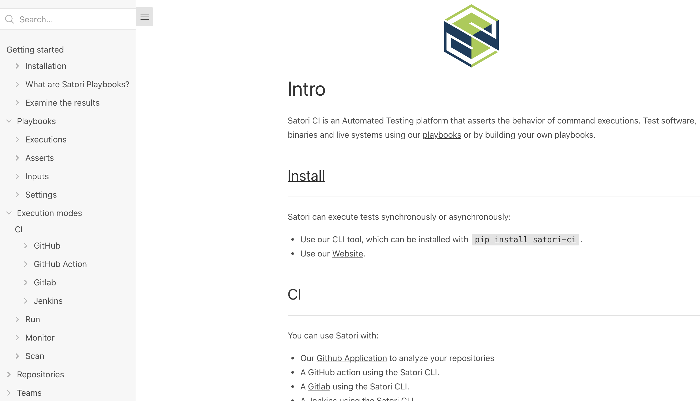

# Satori CI Documentation

Introduction: Satori CI is a Continuous Integration (CI) tool designed to streamline your development workflows. It provides seamless integration with your projects, offering automated build, test, and deployment capabilities.

The Satori CI documentation automatically installs with the CLI tool when you run `pip install satori-ci`. To install the documentation separately, run `pip install satori-docs`.

After installation, view the documentation in your console by running `satori-docs`:

Or in the web:

- For local web access, install vitepress cli with `npm install -g vitepress && npm ci`, execute `npm run docs:dev` and visit `http://localhost:9090` in your browser.
- For remote access, visit our documentation website at [https://docs.satori.ci/](https://docs.satori.ci/).

