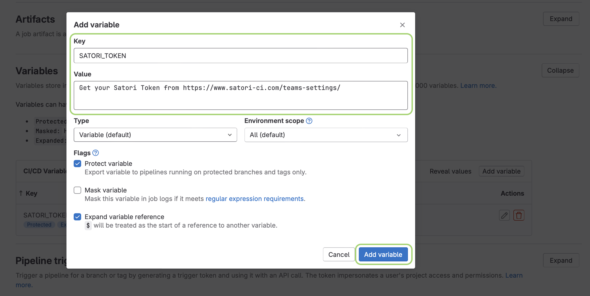

# Gitlab CI/CD

These are the steps to configure Gitlab to upload your project to Satori using your token.

**1) Log in Gitlab**

**2) Select your project**

**3) Click on Build -> Pipeline editor**


**4) Define the following script to install satori, configure its token and upload the code**

```yml
image: python:latest

variables:
  SATORI_TOKEN: $SATORI_TOKEN

SatoriCI:
  stage: build
  script:
    - pip3 install satori-ci
    - satori config token $SATORI_TOKEN
    - satori upload ./ --sync
```


Click on **Commit changes**

5) **Go to Settings -> CI/CD**


6) **Expand the `Variables` and click on Add variable**

Define the `SATORI_TOKEN` value:

- **Key**: `SATORI_TOKEN`
- **Value**: `<token>`



Click on **Add Variable** and you are set.