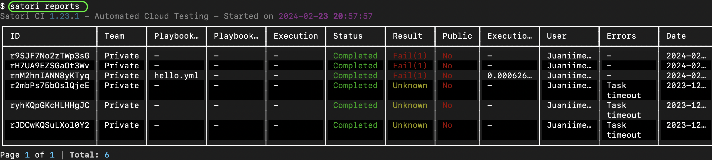
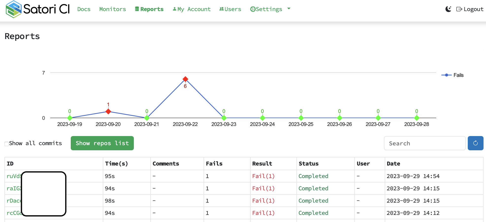
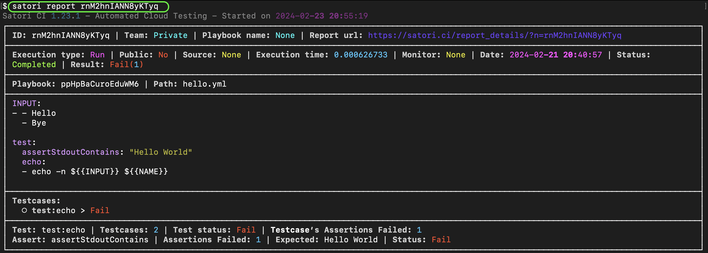
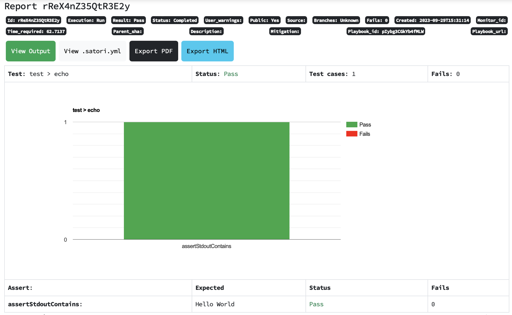
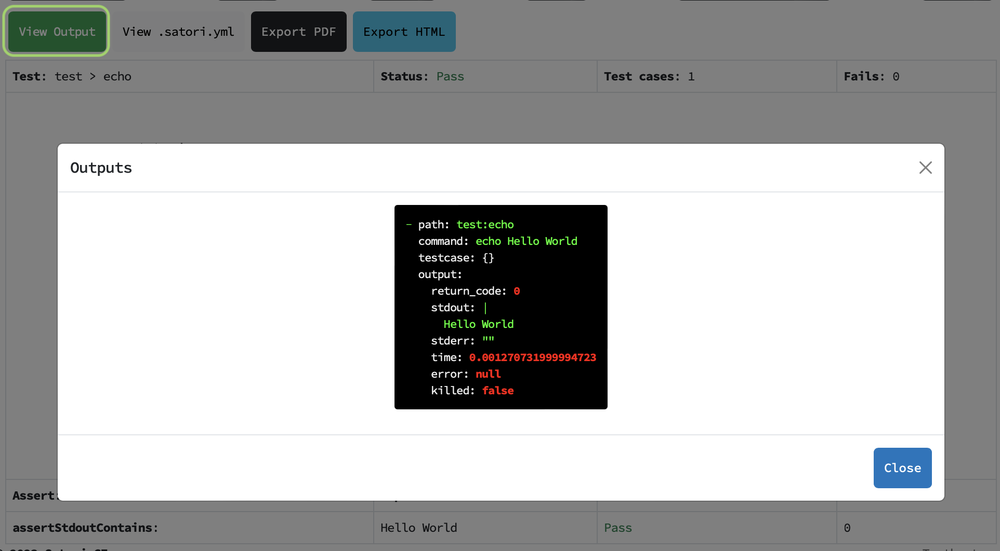

# Playbook results

Satori is a automated testing platform that runs playbooks to assert conditions. Once the execution of a playbook is completed, we deliver a report with either a *Pass* or *Fail* state. In case there were errors on the execution, the result will be flagged as *Unknown*.

You can take different actions on your reports with the `satori` command and with the web interface.

## Reports

## List

The following command will list your reports on the command line:

```sh
satori reports
```



They are listed on the website as well:

- <https://satori.ci/reports/>



In both cases you can get the report ids of them if you would like to see the results

### List Options

#### Filter

The filter parameter allows you to specify:

- **repo**: which repo is associated (ie, satorici/satori-cli)
- **playbook**: the playbook URLs (ie, satori*//code/semgrep.yml)
- **status**: what is the status (Pending, Running, Completed or Undefined)
- **result**: was the report a pass or a fail? (Pass or Fail)
- **from**: limit to commits from this specific date (format: year-month-day, ie: 2020-12-30)
- **to**: limit to commits until this specific date (format: year-month-day, ie: 2023-01-10)
- **satori_error**: an error occurred during report generation? (True or False)
- **email**: filter by pusher email
- **user**: filter by satori user name
- **type**: the report execution type (monitor, github or playbook_bundle)

Then this parameters can be used to check specific reports that you are looking for:

- Example: _"I want to see all failed reports for the repositories of the account satorici"_

```sh
satori report --filter="repo=satorici/*,result=fail"
```

- Example: *"I want to see a list of reports related to the playbook trufflehog"*

```sh
satori report --filter="playbook=satori://code/trufflehog"
```

#### Page

If more than 10 results are found, then the first page will be shown. To show subsequent pages, please use the `-n X` command, where X represents the page that you would like to access.
A summary of the execution data and the command output with the assertions applied. You can see it using the report ID in the CLI:

### Single report

To view a specific report you need to specify the report ID this way:

```yml
satori report REPORT_ID
```



Or on the web:



## Command output

The raw output of each command executed (stdout, stderr, testcase, errors).

```yml
satori report REPORT_ID output
```

Or on the web:



## Files

Optionally if your execution generates some files you can download them this way using the CLI.

```yml
satori report REPORT_ID files
```
