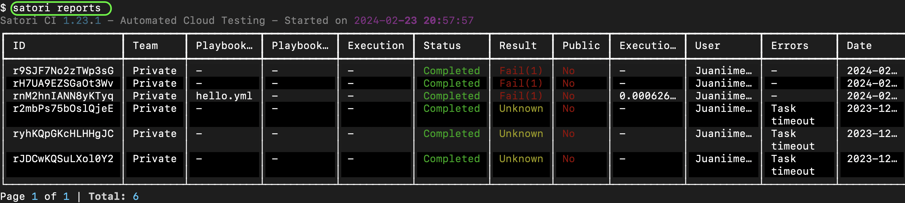
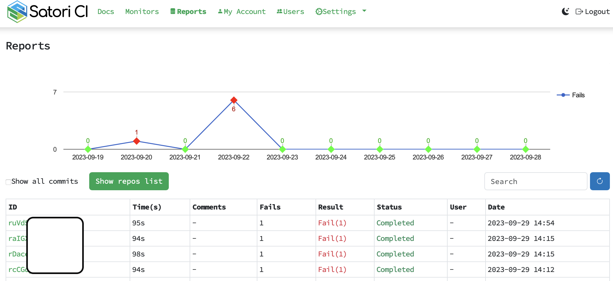
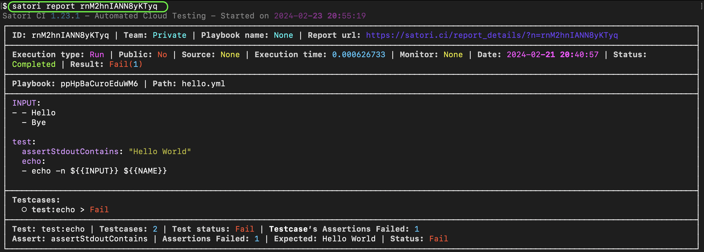
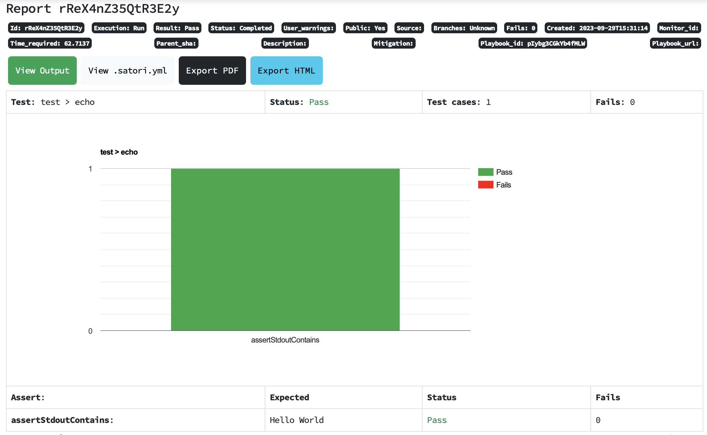
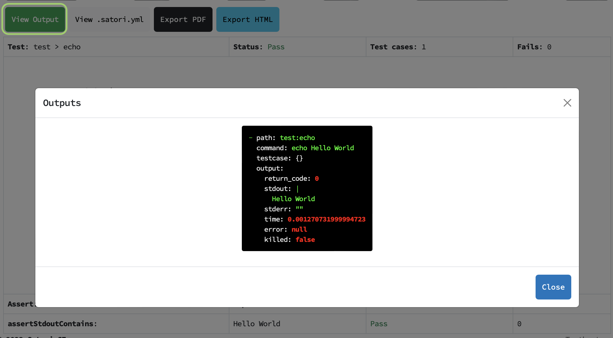

# Playbook results

Satori-CI is an automated testing platform that executes Playbooks to validate conditions. After a Playbook is run, the platform generates a report indicating the result of the test, we deliver a report either a *Pass* or *Fail*.

You can view and manage your test reports using either the command line interface or on the web.

## Listing Reports

To list all your reports from the command line, use the following command:

```sh
satori-v2 reports
```



You can also view your reports on the Satori-CI website at:

[https://satori.ci/reports/](https://satori.ci/reports/)



Both methods allow you to obtain the report IDs, which you can use to view single report.

In CLI v2 a *report* is the result of an **execution**. Executions belong to a **job** (a run, scan, monitor or local execution). You can list the executions of a single job by passing its ID, and filter by execution status:

```sh
satori-v2 reports JOB-ID
satori-v2 reports --status RUNNING
satori-v2 reports --public --json
```

`--status` accepts `FINISHED`, `CANCELED`, `RUNNING` or `QUEUED`. See [Jobs, Executions & Output](../modes/executions.md) for the full job/execution model.

## Filtering Reports

You can filter your reports using various parameters to narrow down the results with `satori-v2 reports search`:

| Filter | Description |
| --- | --- |
| `--job-type {RUN\|SCAN\|MONITOR\|GITHUB\|LOCAL}` | Filter by the type of job that produced the execution |
| `--job-id ID` | Filter by job ID |
| `--global` | Include public executions from other accounts |
| `--status {FINISHED\|CANCELED\|RUNNING\|QUEUED}` | Filter by execution status (repeatable) |
| `--visibility {PUBLIC\|PRIVATE\|UNLISTED}` | Filter by report visibility |
| `--from DATETIME` | Executions created after this ISO datetime (e.g. `2026-01-31` or `2026-01-31T10:00:00`) |
| `--to DATETIME` | Executions created before this ISO datetime |
| `--report-status {PASS\|FAIL}` | Filter by report result |
| `--severity {0-5}` | Filter by output severity |
| `--playbook URI` | Filter by playbook |
| `--q TEXT` | Free text search |
| `-t, --tag TAG` | Filter by tag (repeatable) |

These parameters can be used to check and filter specific reports that you are looking for.

- Example: _"I want to see all failed reports of my scans"_

```sh
satori-v2 reports search --job-type SCAN --report-status FAIL
```

- Example: *"I want to see a list of reports related to the playbook trufflehog"*

```sh
satori-v2 reports search --playbook satori://code/trufflehog
```

- Example: *"I want to see the running executions of the job 1234"*

```sh
satori-v2 reports search --job-id 1234 --status RUNNING
```

The same filters are accepted by `satori-v2 reports download`, `satori-v2 reports stop`, `satori-v2 reports delete` and by the top-level `satori-v2 search` command, which lets you act on everything that matches (download outputs, download reports, stop or delete). See [Jobs, Executions & Output](../modes/executions.md#search).

::: warning On development
The v1 filters `--repo`, `--result`, `--monitor`, `--execution` and `playbook-type` are not available in CLI v2. Use `--job-type`, `--job-id` and `--report-status` instead. The v1 syntax is kept here for reference:

```sh
satori-v2 reports search --repo "satorici/*" --result fail
```
:::

## Pagination

When dealing with a large number of results, such as reports, repositories, or monitors, we provide a pagination system to help you navigate through the data more efficiently. To access additional pages, use the `--page X` option, where `X` represents the page number you want to view, and `-q X` (`--quantity`, also `-l`/`--limit`) to set how many results are shown per page (default 10).

```sh
satori-v2 reports --page 2 -q 20
```

## Viewing a Single Report

To view a specific report, specify the report ID as follows:

```sh
satori-v2 report REPORT_ID
```



Or on the web:



## Command output

This displays a summary of the execution data along with the command output and assertions applied.

```sh
satori-v2 report REPORT_ID output
```

Or on the web:



The same output is available with the shorter `satori-v2 output REPORT_ID` command, which also supports `--raw` to pipe the encoded results to stdout. See [Jobs, Executions & Output](../modes/executions.md#output).

## Issues

Failed asserts and tool hits (semgrep, pyspector, etc.) can be listed as **issues**, sorted by severity. List all of them, or limit to one report:

```sh
satori-v2 issues
satori-v2 issues REPORT_ID
satori-v2 report REPORT_ID issues
```

`issues REPORT_ID` and `report REPORT_ID issues` are equivalent. Issues can be filtered (`--status`, `--source`, `--severity`, `--order`), triaged with `issue FINDING-ID status`, commented on with `issue FINDING-ID comment`, and turned into a draft GitHub security advisory with `issue FINDING-ID advisory` (then `--publish`); see [Issues](../issues.md).

## Configuring Report Visibility

You can configure the visibility of your results report with three distinct settings to manage who can view it:

- **`private`**: accessible only to the owner or specifically permitted users.
- **`unlisted`**: accessible only to individuals with a direct link to the report. This visibility is useful for sharing specific results without making them publicly.
- **`public`**: open access, visible to all users without restrictions.

To set the visibility of a report, use the following command and specify the visibility level:

```sh
satori-v2 report REPORT_ID visibility [private|unlisted|public]
```
These configurations provide flexible control over report access, allowing you to choose the visibility level that best suits your sharing needs.

## Downloading Files

If your execution generates files, you can download them using the CLI:

```sh
satori-v2 report REPORT_ID files
```

---

## Advanced Report Command Options

The `satori-v2 report` command provides several options for viewing and managing execution results.

### Output Formatting

| Flag | Description | Example |
| --- | --- | --- |
| `--json` | Print the report as JSON | `satori-v2 report ID --json` |
| `--format {json\|md}` | Set output format (JSON or Markdown) | `satori-v2 report ID output --format md` |
| `--test TEST_NAME` | Filter output for specific test (repeatable) | `satori-v2 report ID output --test my_test` |
| `--unredacted` | Show unredacted parameters and secrets *(on development)* | `satori-v2 report ID --unredacted` |

::: warning On development
`--unredacted` is not available yet in CLI v2. The v1 syntax is kept here for reference.
:::

### Issues

List the issues (failed asserts and tool hits) of a report, sorted by severity:

| Command | Description | Example |
| --- | --- | --- |
| `issues` | List the issues of the report | `satori-v2 report ID issues` |
| `issues --json` | List the issues as JSON | `satori-v2 report ID issues --json` |

The same list is available as `satori-v2 issues ID`. To create a draft GitHub security advisory from an issue use `satori-v2 issue FINDING-ID advisory`, then publish it with `--publish` (see [Issues](../issues.md)).

### GitHub Issue Creation

::: warning On development
`satori-v2 report ID issue TEMPLATE_ID [--query --title]` is not available yet in CLI v2. The v1 syntax is kept here for reference. In v2, use `satori-v2 issue FINDING-ID advisory` to create a draft GitHub security advisory from an issue, then `--publish` to publish it.
:::

Create GitHub issues directly from report results:

| Flag | Description | Example |
| --- | --- | --- |
| `issue TEMPLATE_ID` | Create issue using template *(on development)* | `satori-v2 report ID issue template_123` |
| `--query "SEARCH"` | Filter with search query *(on development)* | `satori-v2 report ID issue template_123 --query "critical"` |
| `--title "TITLE"` | Override issue title *(on development)* | `satori-v2 report ID issue template_123 --title "Security Issue"` |

### Report Management

| Command | Description | Example |
| --- | --- | --- |
| `status` | Get report execution status *(on development)* | `satori-v2 report ID status` |
| `stop` | Stop running report *(on development)* | `satori-v2 report ID stop` |
| `delete` | Delete report | `satori-v2 report ID delete` |
| `visibility VALUE` | Set report visibility (`PUBLIC`, `PRIVATE`, `UNLISTED`) | `satori-v2 report ID visibility unlisted` |
| `files` | Download the files generated by the execution | `satori-v2 report ID files` |
| `set-team TEAM` | Assign report to team *(on development)* | `satori-v2 report ID set-team my_team` |

::: warning On development
`satori-v2 report ID status`, `satori-v2 report ID stop` and `satori-v2 report ID set-team` are not available yet in CLI v2. The v1 syntax is kept here for reference. In v2 the status is shown by `satori-v2 report ID`, and a running execution can be stopped with `satori-v2 execution stop ID` or `satori-v2 search --job-id JOB-ID --stop` (see [Jobs, Executions & Output](../modes/executions.md)).
:::

### Complete Examples

**View report output in Markdown format:**

```sh
satori-v2 report AOQxDWDkXpZp output --format md
```

**View specific test output with unredacted secrets** *(on development)*:

```sh
satori-v2 report AOQxDWDkXpZp output --test integration_test --unredacted
```

**List the issues of a report and create a GitHub advisory from one of them:**

```sh
satori-v2 report AOQxDWDkXpZp issues
satori-v2 issue FINDING_ID advisory
satori-v2 issue FINDING_ID advisory --publish
satori-v2 advisories
satori-v2 advisory ADVISORY_ID
satori-v2 advisory ADVISORY_ID visibility private
```

**Create GitHub issue from report** *(on development)*:

```sh
satori-v2 report AOQxDWDkXpZp issue template_123 \
  --query "severity:critical" \
  --title "Critical Security Vulnerability Found"
```

**Filter multiple tests:**

```sh
satori-v2 report AOQxDWDkXpZp output \
  --test unit_tests \
  --test integration_tests \
  --format md
```

These advanced options give you fine-grained control over how you view and share execution results.
