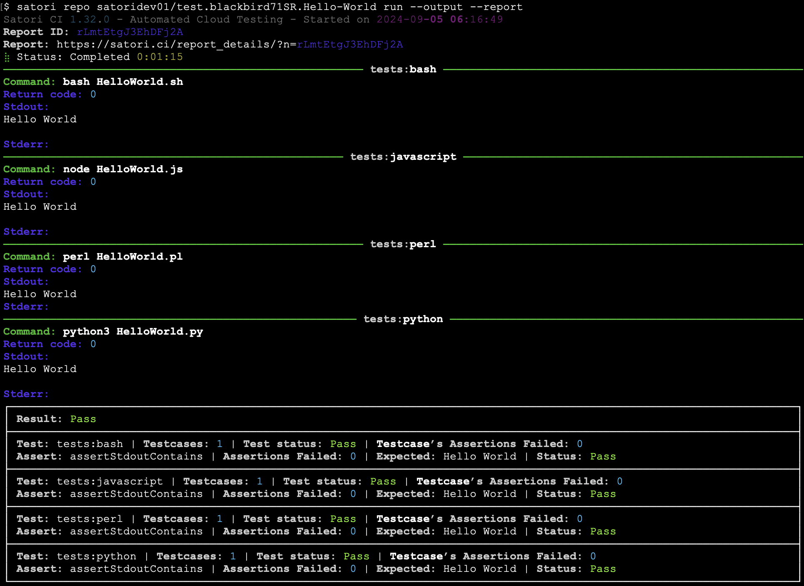
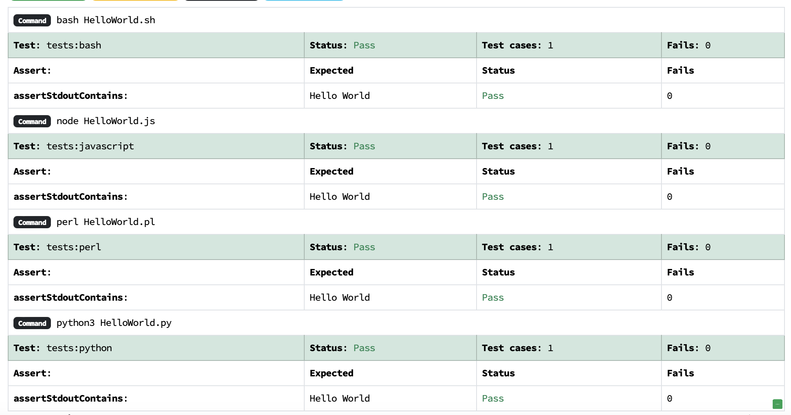
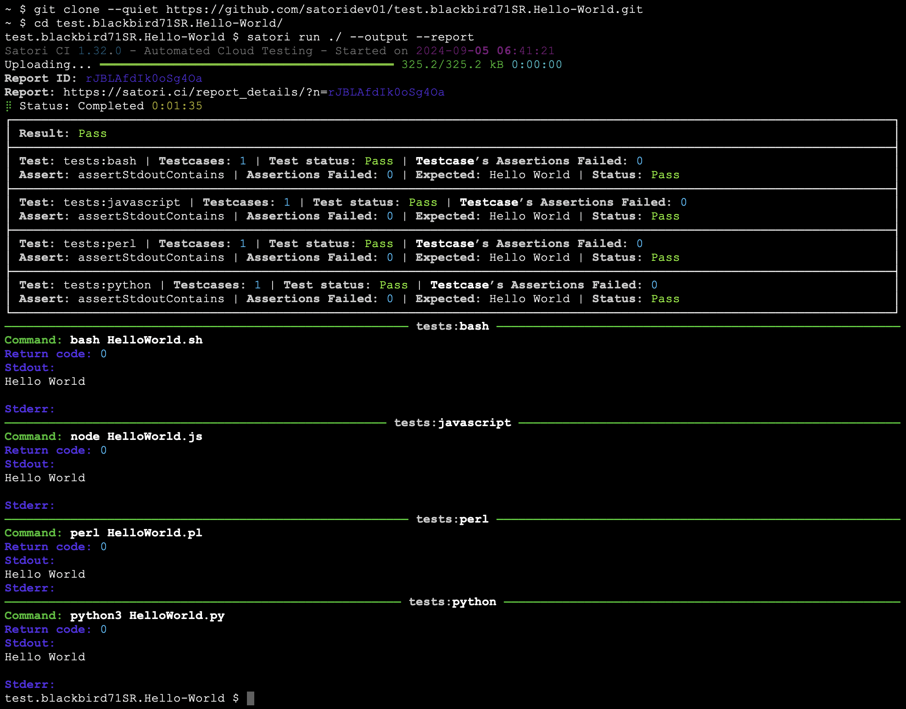
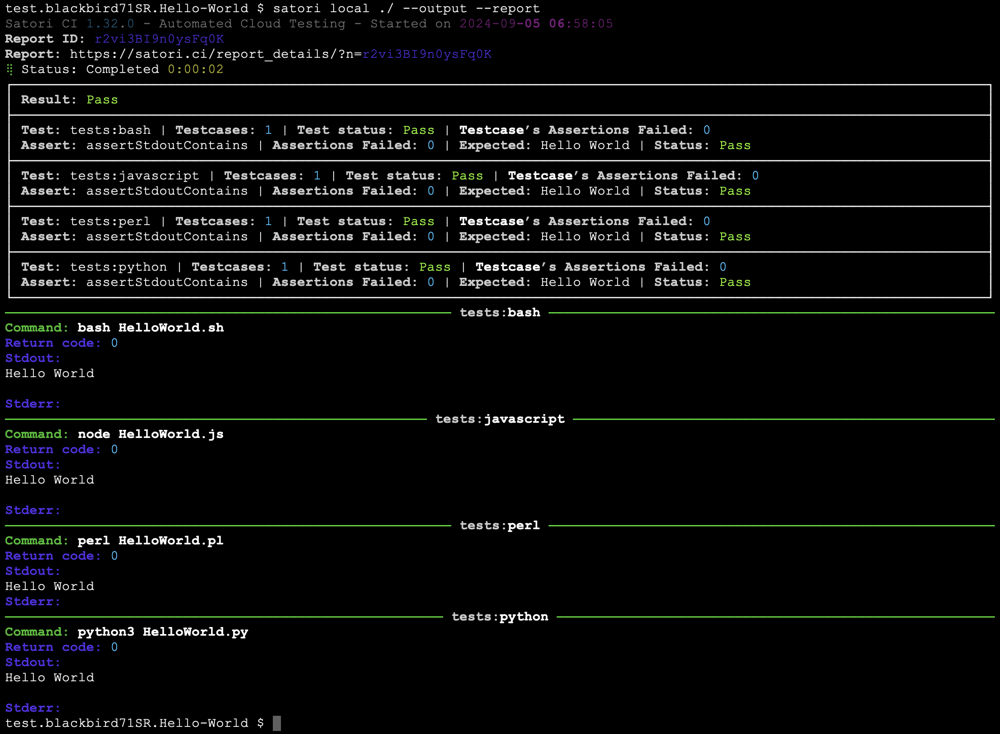

# Hello World Test

The most basic program that we can have for a programming languages is one that prints "Hello World" on the screen. The most popular [repository](https://github.com/blackbird71SR/Hello-World) on Github about this has a great collection to start testing.

We have made a fork of that repository and created our own .satori.yml file within it to test 4 languages:

```yml
settings:
  name: Polyglot Hello World Test
  image: nikolaik/python-nodejs
  
tests:
  assertStdoutContains: Hello World
  
  bash:
    - bash HelloWorld.sh
  javascript:
    - node HelloWorld.js
  perl:
    - perl HelloWorld.pl
  python:
    - python3 HelloWorld.py
```

The previous playbook uses an image that has preinstalled node and python. Bash and Perl come by default, so no need to install them separatedly.

Since the playbook is present in the repository, we can run satori on this repo and it will automatically use the .satori.yml defined, showing the report and the output:

`satori repo satoridev01/test.blackbird71SR.Hello-World run --output --report `

This is how the output and the report will look like on the console:



Since we have made the report public with `satori report rLmtEtgJ3EhDFj2A public`, you can also check it out [online](https://satori.ci/report_details/?n=rLmtEtgJ3EhDFj2A):



In case you would like to run a test from code that you would have on your computer, you can simulate that by cloning the repo and run it uploading the files:

```sh
~ $ git clone --quiet https://github.com/satoridev01/test.blackbird71SR.Hello-World.git 
~ $ cd test.blackbird71SR.Hello-World/
test.blackbird71SR.Hello-World $ satori run ./ --output --report
```

This is out it looks:



If you want to run the commands locally and upload your outputs to be analyzed, this would be your command:

`satori local ./ --output --report`

And it would look like this:


