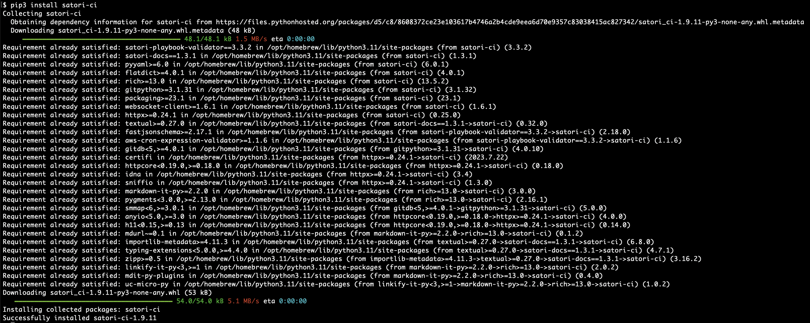
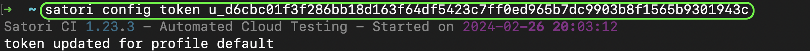
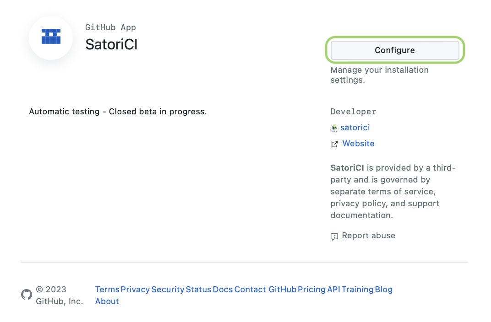

# Install

We have a CLI tool that can be installed with `pip` and a [Github Application](../modes/ci/github.md) to connect with your CI process. Additionally, we can also be launched on [Gitlab](../modes/ci/gitlab.md), with [Jenkins](../modes/ci/jenkins.md) or [Github Actions](../modes/ci/action.md). Of course, our Web interface is also a key component at <https://satori.ci> to better visualize your results.

## Install Satori CLI

Three steps:

1. Execute in your command line terminal:

```console
pip3 install satori-ci
```



2. With Satori CLI installed, now we need to get a Satori Token to use it:

  * Log in the Satori website using Github credentials: https://satori.ci/login
  * On the Satori website go to Settings->Teams
  * Copy your API Token

3. Replace the string YOUR_TOKEN with your clipboard on the next command:

```console
satori config token YOUR_TOKEN
```



## Install Satori CI Github App

Each time you push code to your Github repository, there's a risk that it could affect the security of your project. Furthermore, should your data ever be compromised, it's crucial to minimize the exposure of sensitive information. Two primary areas of concern are:

* Secrets on your code
* Vulnerable code from yourself or third parties

Automatically test your GitHub repositories by installing our App:

**1) Satori CI for Github** <https://github.com/apps/satorici>



Be mindful that you need to be authenticated to configure it.

**2) Click on Configure**


Select on which accounts you will be setting it up.

**3) Select the repositories where you will be installing it or select all repositories**


Once you are done, click on **Save**. We care about your security, so we will only store your email, your repositories names, and the reports. Your code only lives within the virtual machines that are present during the execution.

---

Now it would be a good time to follow up on how to test a [Hello World](hello_world.md) to break the ice and get you on practical examples right away.

If you need any help, please reach out to us on [Discord](https://discord.gg/NJHQ4MwYtt) or via [Email](mailto:support@satori-ci.com)
