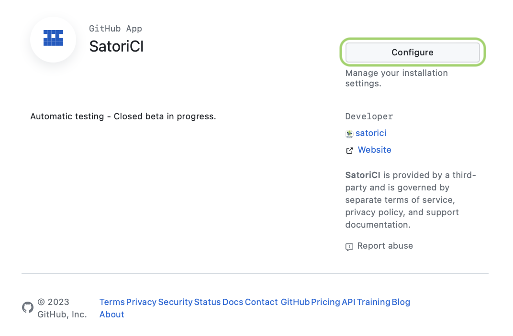
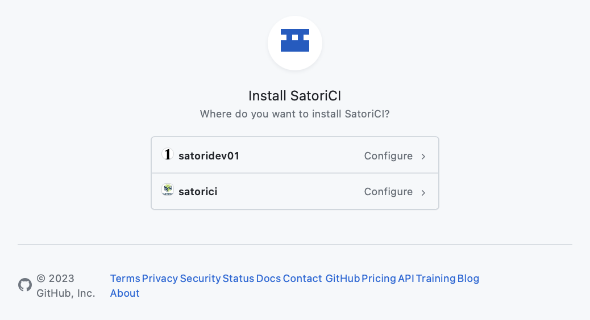
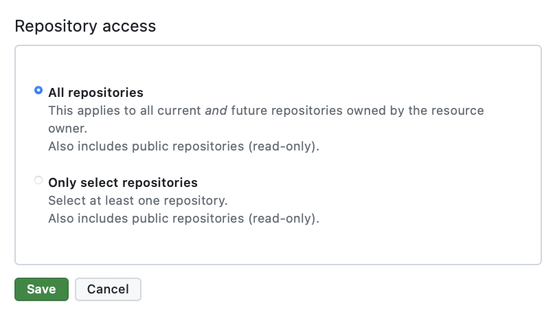
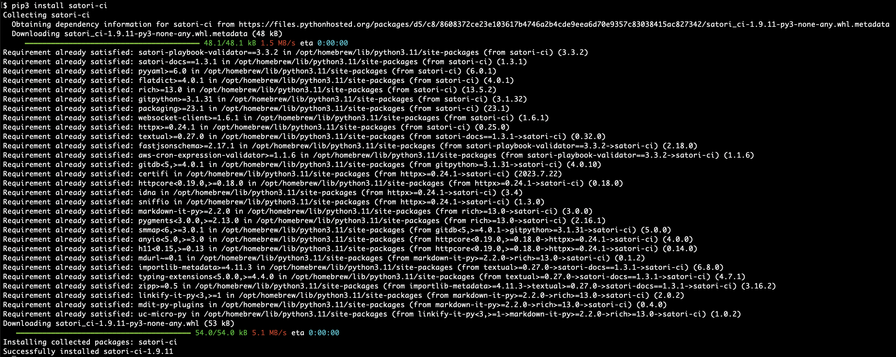
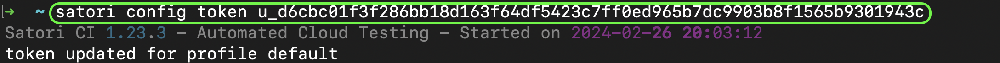

---
next:
  text: 'Hello World Test'
  link: '/getting-started/hello_world'
---

# Install

We offer various installation options and integrations to fit your development workflow. You can connect Satori via CLI, which can be installed using pip, or integrate it with your [Github Application](../modes/ci/github.md). Additionally, we support integration with other CI/CD platforms, such as [GitLab](../modes/ci/gitlab.md) or [Jenkins](../modes/ci/jenkins.md). To enhance your experience and better visualize your test results, we provide a user-friendly web interface <https://satori.ci>.

## Install Satori CI Github App

We recommend that you use your Github account to automatically test your repositories. You can create an account without Github, but that won't allow you to scan for repositories' bugs. 

**Step 1: Install the Satori CI GitHub App**

1. Go to the [Satori CI GitHub App page](https://github.com/apps/satorici). Authenticate with GitHub to proceed with the installation.
   

   
2. Click on **Configure**.
   


3. Choose the GitHub accounts where you are installing the Satori CI App.
4. Select the repositories where you want to install the app. We recommend to select **All repositories**.
   


Once you are done, click on **Save**. 

If you are pushing code, we will check it with the repository playbooks and the default playbooks defined. Your code only lives within the virtual machines that are present during the execution, it only remains on your Github account.

---


## Install Satori CLI

The CLI interface is the best way to interact with Satori. New functionalities get pushed here first, and that allow us to test ourselves before pushing the new features to the web. 

**Step 1: Install the Satori-CI CLI**

Open your command line terminal and execute the following command to install the Satori CLI:

```console
pip install git+https://github.com/satorici/cli-v2
```

The console script is named `satori-v2` so it can coexist with the v1 `satori` CLI. To update it later, run `satori-v2 update` (it reinstalls the CLI from git with pip).



**Step 2: Obtain Your Satori Token**

To use Satori-CI, you need to get your API Token. Follow these steps:

0. Log in to the Satori website [https://satori.ci/login](https://satori.ci/login).
1. Navigate in the Satori CI website to your Profile.
2. Copy your API Token.

**Step 3: Configure Satori-CI**

Replace the placeholder `YOUR_TOKEN` on the next command with your Satori CI API Token:

```console
satori-v2 config token YOUR_TOKEN
```



**Configuration**

The token is stored in `~/.satori_credentials.yml`, one section per profile. `satori-v2 config token YOUR_TOKEN` writes to the `default` profile; use `--profile NAME` (only valid on `satori-v2 config`, e.g. `satori-v2 config token TEAMTOKEN --profile TEAM`) to keep a team token on a separate profile. Run `satori-v2 config` to print the current configuration.

To set a GitHub personal access token used by the platform (for example for advisory workflows), run `satori-v2 config pat YOUR_GITHUB_PAT`. Check the active profile and whether a PAT is configured with `satori-v2 whoami`.

The following environment variables are read directly and take precedence over the credentials file:

- `SATORI_TOKEN`: the API token to use (handy for CI, no `config` step needed).
- `SATORI_PROFILE`: the profile to use (overrides `--profile`).
- `SATORI_ENDPOINT`: the API endpoint (default: `https://api-v2.satori.ci`).

### Next Steps

Learn how to automatically test "[Hello World](../getting-started/hello_world.md)".

---

If you need any help, please reach out to us on [Discord](https://discord.gg/NJHQ4MwYtt) or via [Email](mailto:support@satori.ci)
