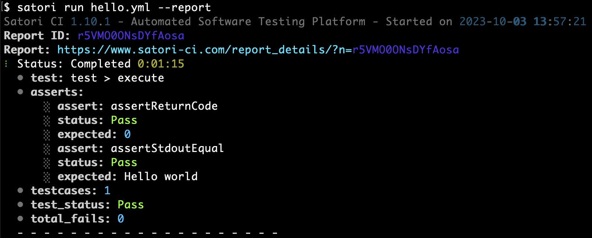
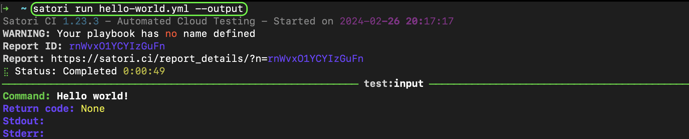

# Playbooks overview

In Satori, the files where testing procedures are defined are known as Playbooks. These files use YAML syntax and have the ".yml" file extension.

Playbooks may contain a variety of components such as settings, imports, tests, executions, and asserts. All of these elements follow a specific language specification[1].

## Writing your first playbook

In order to test something we first need to get the information. The way to do this is executing commands to get the outputs: stdout, stderr, return code, time spent, etc.

How can you express this? Simple:

```yml
execute:
  - [echo Hello world!]
```

This execution may or may not be correct. We want to know if the return code is zero and if the output contains a certain string:

```yml
test:
  assertStdoutEqual: "Hello world!\n"
  assertReturnCode: 0

  execute:
    - [echo Hello world!]
```

Now we have an actual test: an execution with an assertion. We can have many tests in a single playbook, and also nested tests. Here's something interesting, the `cmd` execution inherits all the 2 assertions and `execute` only gets the return code check:

```yml
test:
  assertReturnCode: 0

  nested-test:
    assertStdoutContains: Bye
    cmd:
      - [echo Bye, see you later!]

  execute:
    - [echo Hello world!]
```

But what if you want to tests many cases? You can reference inputs this way:

```yml
test:
  assertReturnCode: 0

  input:
    - Hello world!
    - See you later!

  execute:
    - [echo $(input)]
```

You can read more about the [language](../playbooks/language.md) features and the possible [asserts](../playbooks/asserts.md).

# Running playbooks

Now you have your shiny new playbook but how to make it do something? We present you two ways to do it.

## CLI

```bash
satori run hello.yml
```



You can explore more functions in the CLI reference but here are some highlights. By running the previous command your playbook will be submitted and run asynchronously, but if you use `--sync`, `--report`, `--output` or `--files` it'll run in sync mode, the last three will also show additional data accordingly.

For example `--output` will display each command output: stdout, stderr, return code, etc.



## CI

You can have a playbook named `.satori.yml` in the root of your GitHub repository. If you have the GitHub App installed, with each push the playbook will be run against the repository contents.

See more about that in [GitHub CI](../modes/ci/github.md)

For more ways to run your playbooks visit the [execution modes](../modes/modes.md) section.
