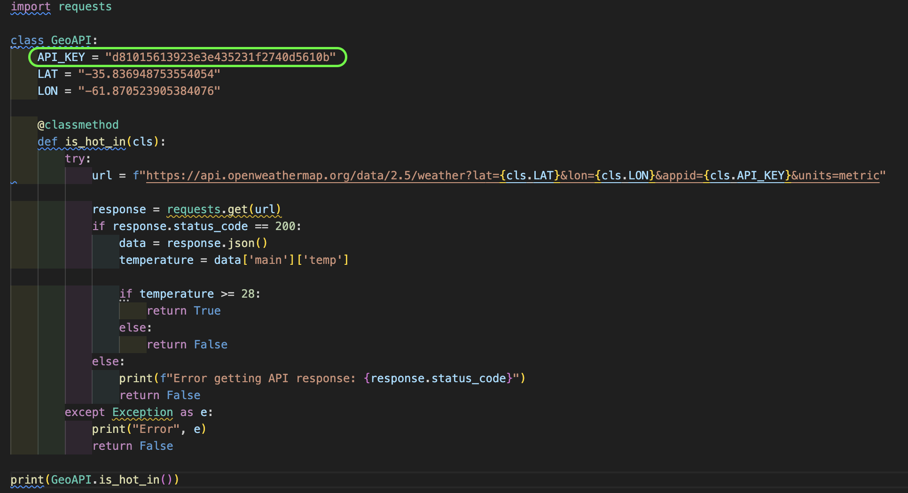
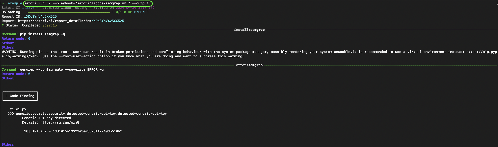
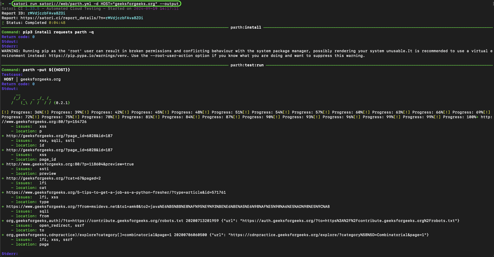

# Playbooks overview

In Satori, testing procedures are defined in files known as Playbooks. These Playbooks utilize YAML syntax and are saved with the ".yml" file extension.

A Playbook may include several key components such as settings, imports, tests, executions, and asserts. Each component follows a specific language specification to ensure consistency and functionality across different Playbooks.

## Writing your first playbook

To begin testing with Satori, you first need to gather information by executing commands. These commands can produce various outputs such as stdout, stderr, return codes, and time spent.
Here’s a basic example of how to execute a command:

```yml
execute:
  - echo Hello world!
```

In this example, the command `echo Hello world!` is executed. However, to validate whether the command works as expected, you need to add assertions. For instance, you can check if the return code is zero and if the output contains a specific string:

```yml
test:
  assertStdoutEqual: "Hello world!\n"
  assertReturnCode: 0

  execute:
    - echo Hello world!
```

In this setup, you have a test that includes both execution and assertions. You can define multiple tests within a single Playbook, and tests can also be nested. For example:

```yml
test:
  assertReturnCode: 0

  nested-test:
    assertStdoutContains: Bye
    cmd:
      - echo Bye, see you later!

  execute:
    - echo Hello world!
```

In this case, the `nested-test` will check if the output contains the string "Bye" while inheriting the assertion of a zero return code from the parent `test`.

If you need to test multiple cases, you can use input references:

```yml
test:
  assertReturnCode: 0

  input:
    - Hello world!
    - See you later!

  execute:
    - echo ${{input}}
```
In this example, the `input` list provides different values to the command `echo`, allowing you to test multiple scenarios.
For more details about the [language](../playbooks/language.md) features and available [asserts](../playbooks/asserts.md).

# Running playbooks

Once you’ve created your Playbook, you need to know how to execute it. There are two primary methods for running Playbooks in Satori:

#### 1. Command Line Interface (CLI)
To run a Playbook from the command line, use the following command:

```bash
satori run hello.yml
```


This command submits your Playbook and runs it asynchronously by default. You can use additional flags like `--sync`, `--report`, `--output` or `--files` to customize the execution
For more details on CLI options and functions, refer to the [CLI Reference](../modes/run.md).

For example `--output` will display each command output: stdout, stderr, return code, etc.


## Public Playbooks
Satori offers a variety of public playbooks that can be used for different security and analysis purposes. These playbooks are primarily divided into two categories: static (SAST) and dynamic (DAST).

### Static Playbooks
Some public playbooks are designed for Static Application Security Testing (SAST). These playbooks are used to analyze source code or integrated into CI processes for automated security checks. You can run these Playbooks by using `satori run ./`:

##### Example:




### Dynamic Playbooks
Dynamic Analysis Playbooks are intended for testing running systems by providing specific parameters, such as the host or service that will be analyzed. These Playbooks are crucial for identifying vulnerabilities in a system’s runtime behavior. A typical DAST Playbook execution will include a parameter:

`satori run satori://playbook -d HOST="host"`



##### 2. Continuous Integration (CI)

You can also run your Playbook automatically using GitHub. To do this:
1. Create a Playbook named `.satori.yml` in the root directory of your GitHub repository.
2. Ensure the Satori GitHub App is installed and configured for your repository.
   
With this setup, the Playbook will be executed with each push to the repository.

See more about that in [GitHub CI](../modes/ci/github.md)
For more ways to run your playbooks visit the [execution modes](../modes/modes.md) section.
