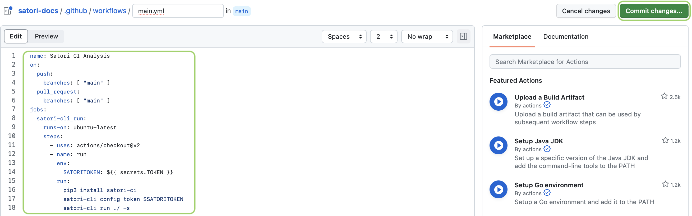
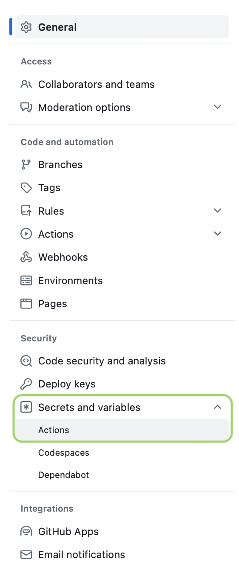
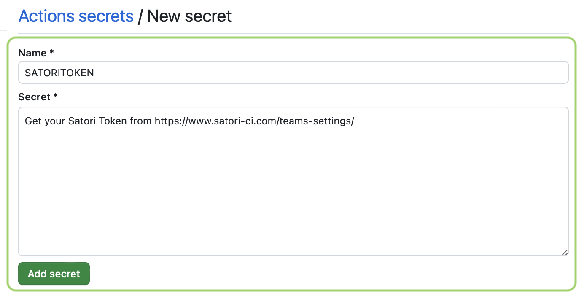

# Integrating Satori with GitHub Actions

If you're looking to test specific parts of your CI/CD workflow using Satori, follow these steps to integrate Satori with GitHub Actions. This integration will allow you to leverage Satori's deep testing capabilities within your automated workflows.

If you want to test part of your workflow with Satori follow these steps:

**1. Navigate to Actions:** 

  Open your GitHub repository and click on the `Actions` tab.


**2. Create a new workflow:**  

  Select `New workflow`, then click set up a workflow yourself to manually configure your workflow file.


**3. Add the Satori job:** 

  In your workflow file, include the Satori job configuration as part of your process. Once added, click `Commit changes` to save your workflow.

```yml
name: Satori CI Analysis
on:
  push:
    branches: [ "main" ]
  pull_request:
    branches: [ "main" ]
jobs:
  satori-cli_run:
    runs-on: ubuntu-latest
    steps:
      - uses: actions/checkout@v2
      - name: run
        env:
          SATORITOKEN: ${{ secrets.SATORITOKEN }}
        run: |
          pip3 install satori-ci
          satori config token $SATORITOKEN
          satori run ./ --sync
```



**4. Set Up Secrets:**

  Go to your repository `Settings`, then click on `Secrets and variables`, followed by `Actions`.



**5. Add a New Secret:**

  Click `New repository secret`.


**6. Configure SATORITOKEN:**

  In the `Name` field, enter SATORITOKEN. For the secret value, paste your Team API Token, which you can find it going to you [Dashboard](https://satori.ci/dashboard), select your team, click on `Settings` and copy your `Team API token`.
Click `Add Secret` to finalize.



---

With these configurations, you will be able to execute tests using GitHub Actions by integrating Satori into your CI/CD pipeline. The provided setup will allow you to run the workflow YAML file within your project. This ensures that critical parts of your project are thoroughly tested during the continuous integration process, enhancing the quality and stability of your software.
