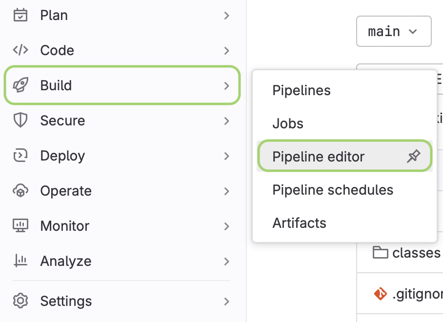
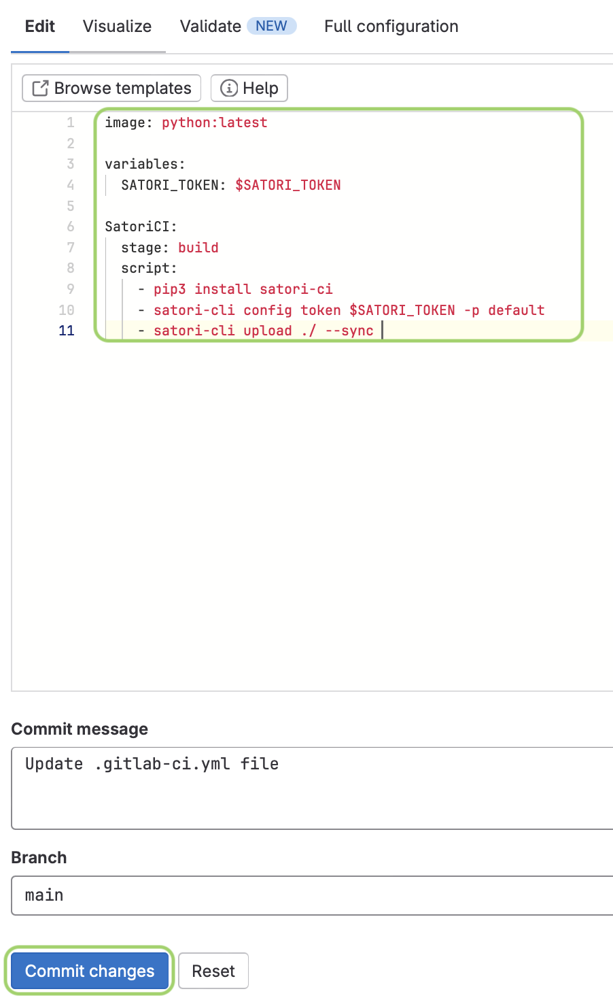
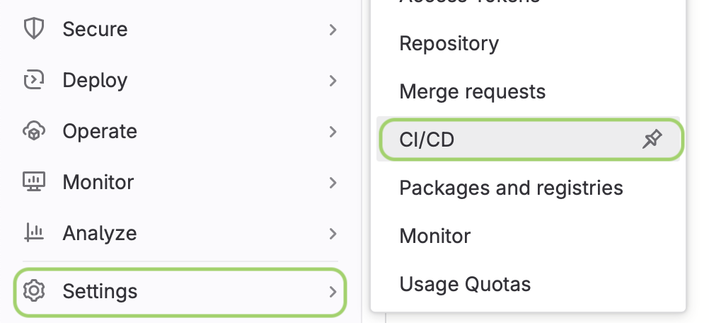

# Integrating Satori with Gitlab CI/CD

To integrate Satori with GitLab, follow these steps. This integration enables automated testing during your CI/CD pipeline, ensuring that tests are executed at each integration point

**1. Log in to GitLab.**  

**2. Select your project:** 

   From your dashboard, choose the project you want to configure for Satori.

**3. Navigate to Pipeline editor:** 

   Go to the project's sidebar and select **Build** > **Pipeline editor**. This is where you’ll configure your GitLab pipeline to communicate with Satori using your project token.



**4. Define the pipeline script:**  
   In the **Pipeline editor**, create a script that will:
   - Install Satori-CI.
   - Configure the Satori token for authentication.
   - Upload your project’s code to Satori for testing.

```yml
image: python:latest

variables:
  SATORI_TOKEN: $SATORI_TOKEN

SatoriCI:
  stage: build
  script:
    - pip3 install satori-ci
    - satori config token $SATORI_TOKEN
    - satori run ./ --sync
```



After defining the script, click **Commit changes** to save the configuration.

**5. Add the Satori token in CI/CD settings:**  

  - Navigate to **Settings** > **CI/CD** in your project.



**6. Expand the Variables section and click Add variable:**

For the secret value, paste your Team API Token, which you can find it going to you [Dashboard](https://satori.ci/dashboard), select your team, click on Settings and copy your Team API token.
   - Set the following variable to securely store your Satori token:
     - **Key**: `SATORI_TOKEN`
     - **Value**: `<token>` (replace `<token>` with your actual Satori token).
       


**7. Click Add Variable to complete the process.**

---
Your project is now configured to communicate with Satori, and automated tests with your playbook configured in your project, will run on every pipeline execution.
