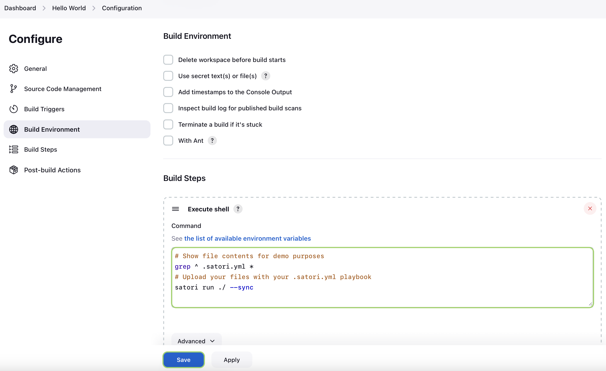

# Jenkins

You want to install:
- Satori CLI
- Jenkins

Once you have Satori and Jenkins installed, it is time to setup Jenkins:

1) Create New Item

Click on “New Item” at the top left-hand side of your dashboard.


2) Enter Item details

  * Enter the name of the item you want to create. We shall use the “Hello world” for this demo.
  * Select Freestyle project
  * Click Okay
  


3) You can optionally configure details about your project


4) Configure the build step that will upload your code and your playbook into Satori. Jenkins may require the full route of `satori`. If it doesn't find it, replace `satori` with path shown by `whereis satori`

```sh
# Show file contents for demo purposes
grep ^ .satori.yml *
# Upload your files with your .satori.yml playbook
satori run ./ --sync
```



5) Click on Build Now


