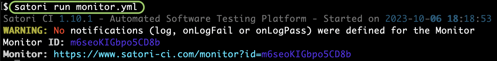
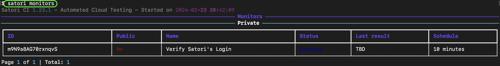
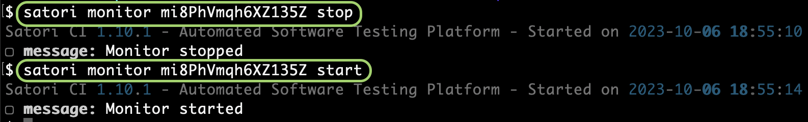
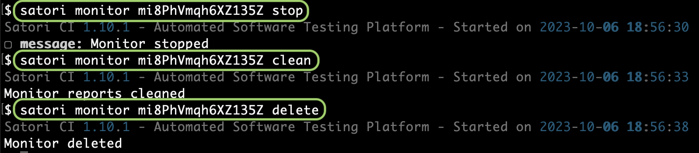

# Monitor

Monitors are playbooks that contain either a `cron` or a `rate` setting in the `settings` section. They are especially useful to assert that the behavior of live systems is working as expected with a certain frequency.

## Cron or Rate Settings

Your playbooks can run with a predefined frequency

### Rate Setting

This is the easiest way of speaking of frequency:

**Rate expression examples**:

| Frequency        | Expression       |
|------------------|------------------|
| Every 10 minutes | rate: 10 minutes |
| Every hour       | rate: 1 hour     |
| Every seven days | rate: 7 days     |

For example, the following file `monitor.yml` checks that the Satori website is live and showing its name every 10 minutes:

```yml
settings:
    name: "Verify Satori's website"
    rate: 10 minutes

test:
    assertStdoutContains: "Satori CI"
    curl:
    - curl -s https://www.satori-ci.com
```

To install this playbook, you just need to run it:

```sh
satori run monitor.yml
```




## List your monitors

Once you have added a monitor, you can list them with the `monitor` command like this:

```sh
satori monitors
```



In case you want to list those monitors that are in a failed state and have pending actions, you would use `--pending` the parameter:

```sh
satori monitors --pending
```


### Stop and Start Monitors

Now, besides listing your monitors, you may want to stop them.

```sh
satori monitor MONITOR_ID stop
```

Or restart them:

```sh
satori monitor MONITOR_ID start
```



### Clean reports and Delete Monitors

Delete all the reports launched by your monitor with `clean`:

```sh
satori monitor MONITOR_ID clean
```

And delete your monitor (that should be already on a stopped state) with `delete`:

```sh
satori monitor MONITOR_ID delete
```



---

If you need any help, please reach out to us on [Discord](https://discord.gg/NJHQ4MwYtt) or via [Email](mailto:support@satori-ci.com)
