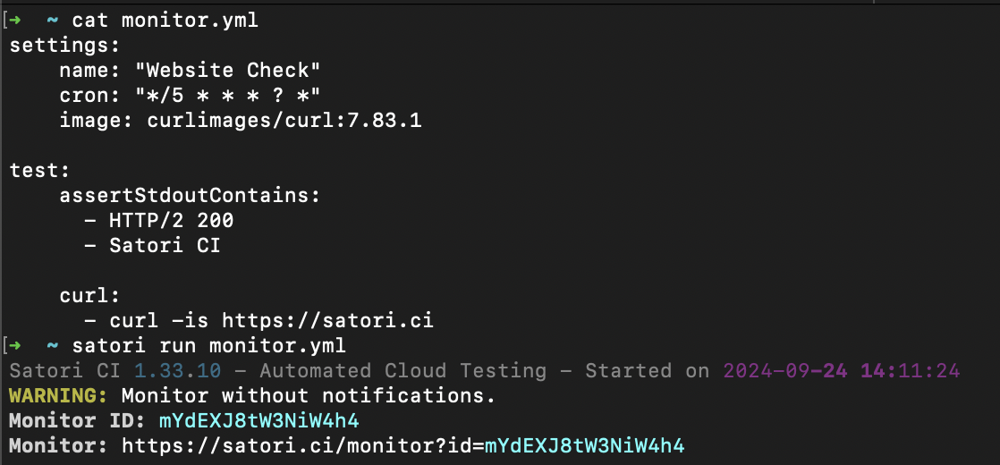
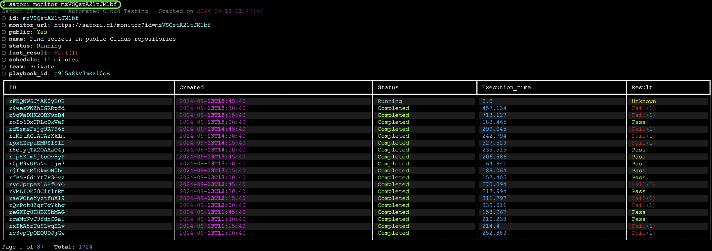
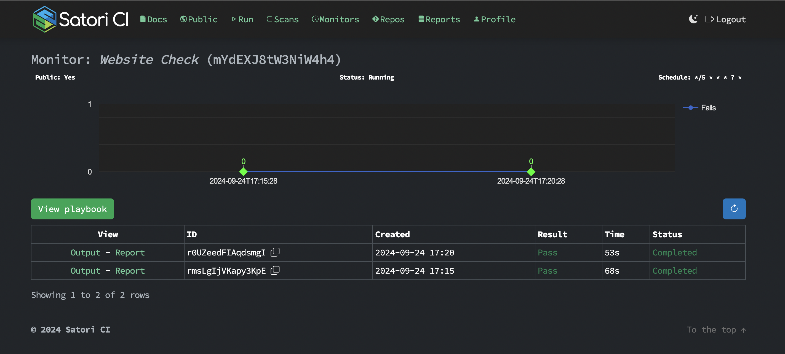

# Monitor

Monitors are an additional configuration option that can be added to playbooks. They provide a way to schedule and automate checks on live systems, ensuring they are functioning as expected over time. Monitors includes a **rate** setting, which specifies how frequently these checks should be performed.
By incorporating monitors into your playbooks, you can regularly validate that your system's behavior aligns with expected outcomes.

## CRON Scheduling

In addition to the simple rate setting, Satori supports AWS-style CRON expressions for more flexible and powerful scheduling options. This CRON format allows you to define complex scheduling patterns, including specific minutes, hours, days of the month, months, days of the week, and even years.

### Expression Format

CRON expressions in Satori follow the AWS CRON format with 6 fields:

```
┌───────────── minute (0 - 59)
│ ┌───────────── hour (0 - 23)
│ │ ┌───────────── day of the month (1 - 31)
│ │ │ ┌───────────── month (1 - 12 or JAN-DEC)
│ │ │ │ ┌───────────── day of the week (1 - 7 or SUN-SAT)
│ │ │ │ │ ┌───────────── year (1970 - 2199)
│ │ │ │ │ │
│ │ │ │ │ │
* * * * * *
```

### CRON Expression Examples

Here are some examples of CRON expressions and their meanings:

| CRON Expression | Meaning                                         |
|-----------------|-------------------------------------------------|
| `0 * * * ? *`   | Run at the start of every hour                  |
| `*/15 * * * ? *`| Run every 15 minutes                            |
| `0 0 * * ? *`   | Run daily at midnight                           |
| `0 0 ? * MON *` | Run every Monday at midnight                    |
| `0 0 1 * ? *`   | Run at midnight on the first day of every month |
| `0 0 1 JAN ? *` | Run at midnight on January 1st every year       |

### Special Characters in CRON Expressions

- `*`: Matches any value in the field
- `,`: Used to specify multiple values (e.g., `MON,WED,FRI`)
- `-`: Defines a range of values (e.g., `MON-FRI`)
- `/`: Specifies increments (e.g., `*/15` for every 15 units)
- `?`: Used instead of `*` for day-of-month and day-of-week to avoid conflict
- `L`: "Last" day of the month or week
- `W`: Nearest weekday to the given day of the month
- `#`: Nth day of the month (e.g., `6#3` for the third Friday of the month)

### Using CRON in Satori Monitors

To use a CRON expression in your Satori monitor, include it in your playbook `.yml` file like this:

```yml
settings:
    name: "Website Check"
    cron: "*/5 * * * ? *"
    image: curlimages/curl:7.83.1

test:
    assertStdoutContains:
      - HTTP/2 200
      - Satori CI

    curl:
      - curl -is https://satori.ci
```

This configuration will run the check every 5 minutes.



CRON expressions provide more flexibility than the simple rate setting, allowing for precise control over when your monitors run. This can be particularly useful for scheduling checks during specific time windows, on particular days of the week, or even for complex yearly schedules. 

## Rate Setting

The **rate** setting allow you to schedule the execution of your playbooks with a predefined frequency. These settings help automate repetitive testing tasks and monitor systems regularly, ensuring they behave as expected over time.

This is the simplest way to define how often a playbook should run. You specify the frequency using a natural language expression.

**Rate expression examples**:

| Frequency        | Expression       |
|------------------|------------------|
| Every 10 minutes | rate: 10 minutes |
| Every hour       | rate: 1 hour     |
| Every seven days | rate: 7 days     |

For example, the following configuration in your playbook `.yml` checks every 10 minutes to verify that the Satori website is live and contains the text "Satori CI."

```yml
settings:
    name: "Verify Satori's Login"
    rate: 10 minutes
    image: curlimages/curl:7.83.1

test:
    assertStdoutContains:
      - HTTP/2 200
      - Satori CI

    curl:
      - curl -is https://satori.ci
```

To run this playbook and start monitoring:

```sh
satori run monitor.yml
```


## Managing Monitors

Once you've added monitors to your playbooks, there are several commands you can use to manage them, such as listing, stopping, starting, cleaning reports, and deleting monitors. 

#### Listing Monitors

After creating monitors, you can list all the active monitors using the `satori monitors` command:

```sh
satori monitors
```


To list only those monitors that are in a **failed state** and have **pending actions**, use the `--pending` parameter:

```bash
satori monitors --pending
```

### Stopping and Starting Monitors

You may need to stop or restart your monitors depending on your testing requirements or if changes need to be applied. Here’s how to manage the state of individual monitors:

- **Stop a Monitor:**

```sh
satori monitor MONITOR_ID stop
```

- **Start (Restart) a Monitor:**

```sh
satori monitor MONITOR_ID start
```


### Monitor's Reports

Monitors generate reports with each run. To manage these reports and the monitors themselves, you have additional commands:

```sh
satori monitor ID
```

Consider the following example:



### Clean reports and Delete Monitors

To delete all the reports generated by a specific monitor, use the `clean` command:

```sh
satori monitor MONITOR_ID clean
```

If you no longer need a monitor, you can delete it. Ensure the monitor is in a **stopped state** before deleting it:

```sh
satori monitor MONITOR_ID delete
```


---

## Monitor web overview

The monitor section provides an overview of all monitors created within your projects. You can see detailed monitor reports on the Satori [web interface](https://satori.ci/monitors/).
This interface provides detailed reports on monitor executions and their results. You can easily navigate through all existing monitors, filter reports by specific monitors, and access comprehensive information about each execution, including the ability to expand and review detailed execution reports.



