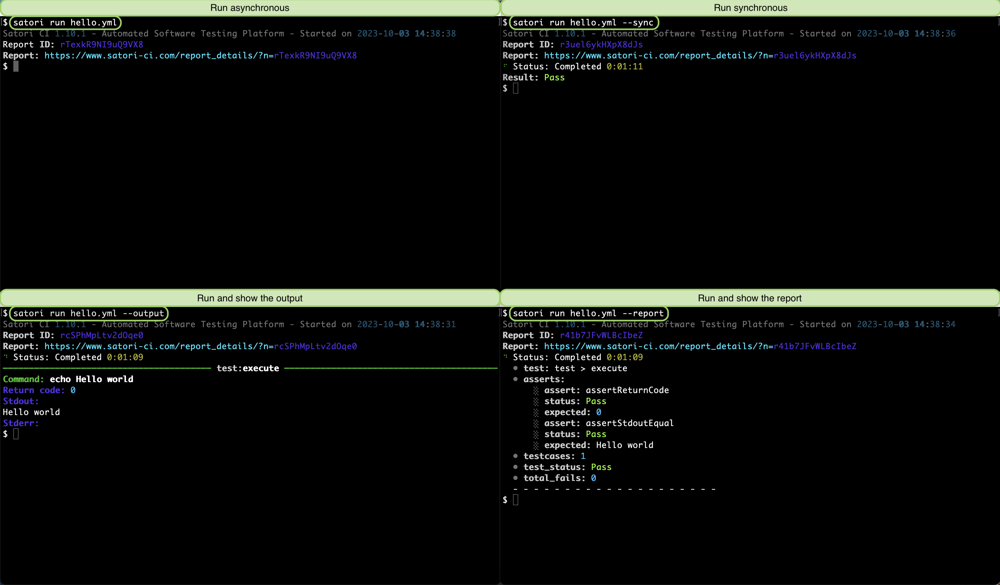
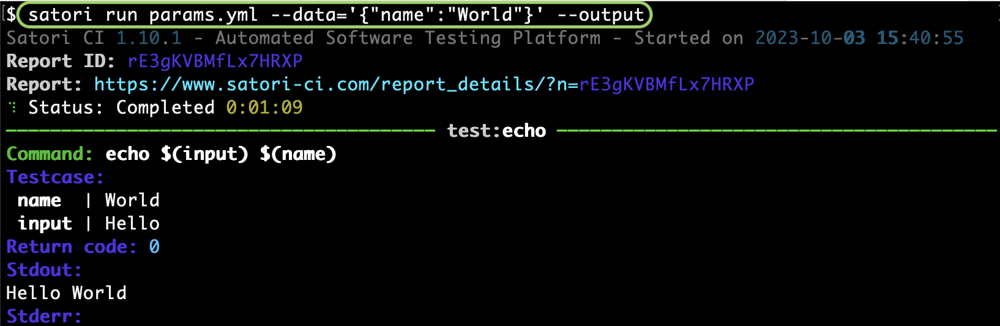
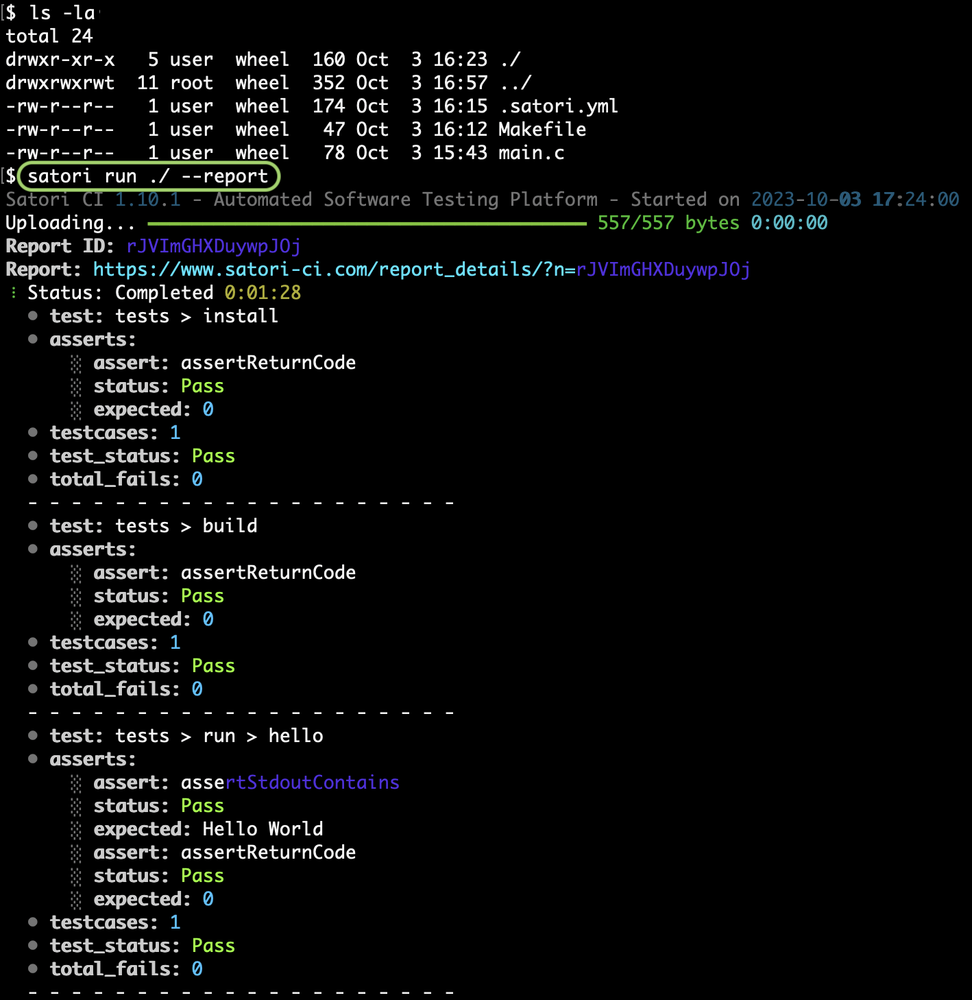
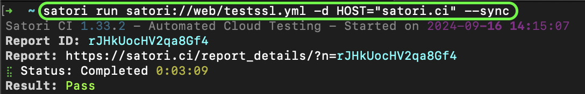
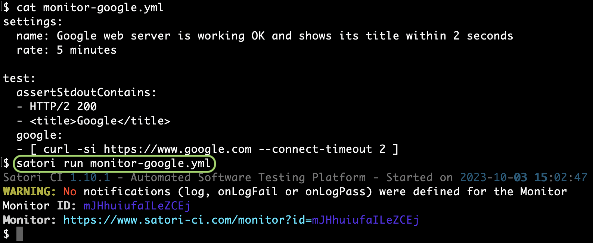

# Run

Satori CLI runs playbooks on demand. Here are some use cases:

### Run a Local Playbook

This playbook named `hello.yml`:

```yml
test:
  assertStdoutEqual: "Hello world\n"
  assertReturnCode: 0

  execute:
    - echo Hello world
```

Can be run:

- With no parameters: asynchronously
- With `--sync`: synchronously and it shows the status when it is complete
- With `--report`: synchronously and it shows the report when it is complete
- With `--output`: synchronously and it shows the output when it is complete



## Run a Playbook with Parameters

If you define $(variables) within your playbook that are not satisfied, they will be considered expected parameters when being called. Consider this playbook named `params.yml` that will echo "Hello" along with the name provided as a parameter:

```yml
input:
- - Hello
test:
- echo ${{input}} ${{name}}
```



### Run with the files in the Local Directory

In case you are working locally on a directory with source code, you save your playbook as `.satori.yml` within the directory, just as you would for your repo when testing your code through CI. 

Consider the following example main.c file, that is referenced by a Makefile, and a playbook that verifies that everything returns the code 0 and when running the code it outputs "Hello World":

- **main.c**:

```c
#include <stdio.h>

int main() {
    printf("Hello World\n");
    return 0;
}
```

- **Makefile**:

```c
all: hello

hello: main.c
  gcc -o hello main.c
```

- **.satori.yml**:

```yml
tests:
  assertReturnCode: 0
  install:
  - apt install -qq -y make gcc
  build:
  - make
  run:
    assertStdoutContains: "Hello World"
    hello:
    - ./hello
```



You would use it like this when developing locally before pushing, or when being used as part of Github Actions or Jenkins.

### Run a Public Playbook

You can run on-demand public playbooks. You can see a list of the publicly available playbooks with: `satori playbook --public`

Then you can execute them passing parameters if required with --data:

```sh
satori run satori://some/playbook.yml
```



You would run it like this when there is a public playbook that already addresses your problem.

### Run a Monitor

When adding the rate or schedule setting, you will be running a playbook with a certain frequency. This playbook named `monitor_google.yml` will check that Google is working as expected once per day:

```yml
settings:
  name: Google web server is working OK and shows its title within 2 seconds
  rate: 5 minutes
  image: dwdraju/alpine-curl-jq

test:
  assertStdoutContains:
  - "HTTP/2 200"
  - "<title>Google</title>"
  google:
  - curl -si https://www.google.com --connect-timeout 2
```

Example execution:


[Learn more about Monitors](monitor.md)