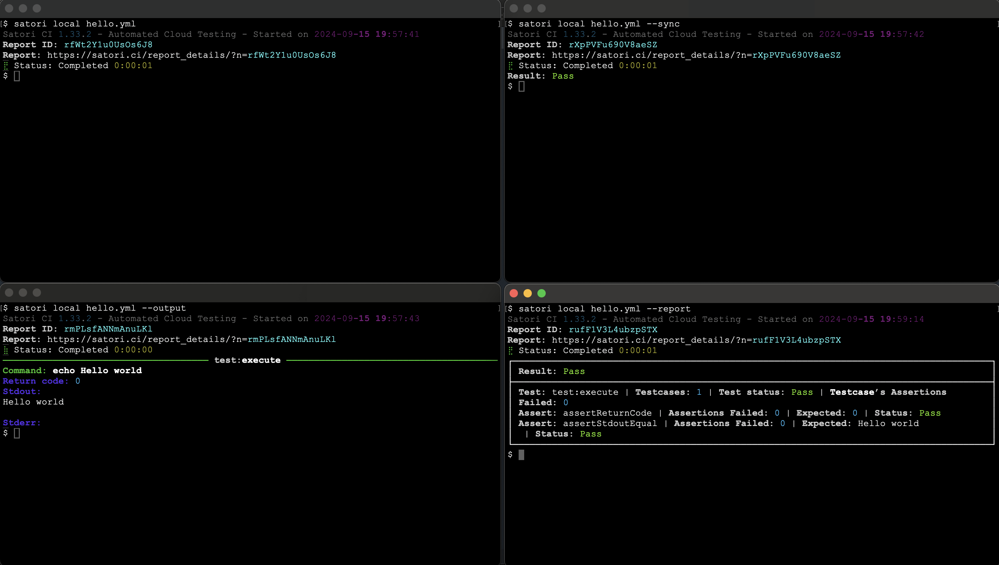
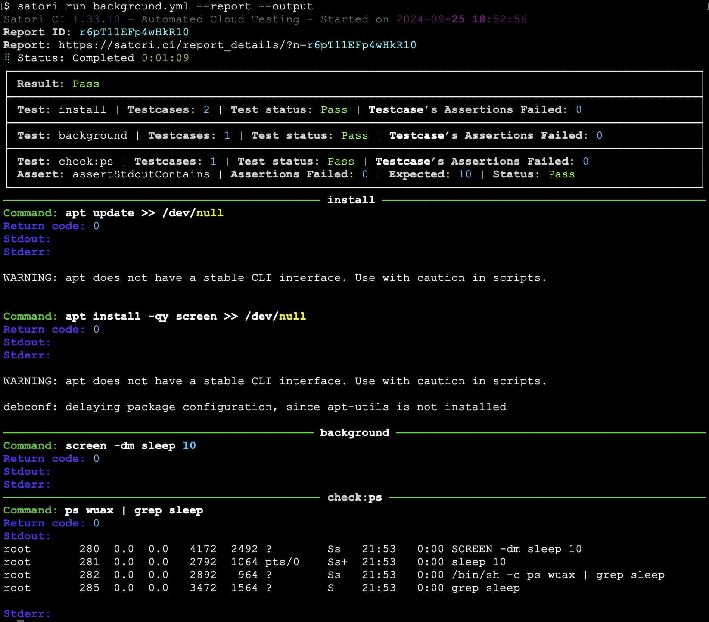

# Run

Satori can be executed in two environments:

**- Remotely:** run Satori on our cloud platform, which allows for scalable and centralized testing without the need for local resources.

**- Locally:** execute Satori on your local machine, providing flexibility for development and testing in a controlled environment.

## Run Remotely

This playbook named `hello.yml` remotely using Satori. This playbook is defined as follows:

```yml
test:
  assertStdoutEqual: "Hello world\n"
  assertReturnCode: 0

  execute:
    - echo Hello world
```
When executing this playbook, you have several options:

**- Asynchronously (no parameters):** run the playbook without any additional parameters.

**- Synchronously with `--sync`:** execute the playbook synchronously, displaying the status upon completion.

**- Synchronously with `--report`:** run the playbook synchronously and generate a report that summarizes the results when it finishes.

**- Synchronously with `--output`:** execute the playbook synchronously, showing the output in real-time as it completes.


## Run Remotely with Parameters

When creating playbooks in Satori, you can include parameters that need to be defined at runtime. If you use a $ symbol in your playbook for a parameter that is not explicitly defined within the playbook, it will be treated as a required parameter when the playbook is executed.

For example, consider the following playbook named `satori://test.yml`, which echoes the parameter ${{WHAT}}:

```yml
test:                                                                                                                                                                             
  assertStdoutContains: Hello World                                                                                                                                               
  hello:                                                                                                                                                                          
  - echo Hello World                                                                                                                                                              
  whatever:                                                                                                                                                                       
  - echo ${{WHAT}}
```
To execute this playbook and provide the required parameter, you would run the command:

```bash
satori run params.yml -d WHAT="Hello World" --output
```


## Local testing with Satori Playbooks

When working locally on a directory containing source code, you can save your playbook as `.satori.yml` within the directory. This approach is similar to how you would structure your repository when testing code through a CI pipeline.

Consider the following example files: `main.c`, a corresponding `Makefile`, and a playbook that verifies the expected behavior of your code.

- **main.c**:

```c
#include <stdio.h>

int main() {
    printf("Hello World\n");
    return 0;
}
```

- **Makefile**:

```c
all: hello

hello: main.c
	gcc -o hello main.c
```

- **.satori.yml**:

```yml
install:
  updates:
    - apt update >> /dev/null
  dependencies:
    - apt install -qy make gcc >> /dev/null

tests:
  assertReturnCode: 0
  build:
    - make
  run:
    assertStdoutContains: "Hello World"
    hello:
      - ./hello
```


This same playbook can also be employed in CI/CD environments. 

## Run a public Playbook

You can execute on-demand public playbooks available in the Satori platform. You can see a list of the publicly available playbooks with: 

```sh
satori playbook --public
```
To run a public playbook, you can execute them passing parameters if required with `-d`:

```sh
satori run satori://some/playbook.yml
```


This allows you to leverage existing public playbooks that may already address your specific testing needs effectively.

## Run Locally

You can execute the playbook named `hello.yml` locally, just as you would run it remotely. This allows you to verify that your playbook functions correctly in your local environment, and Satori will confirm the assertion results. Here’s how you can run it locally:

```sh
satori local hello.yml --sync
```


## Run a process in Background

When running a service that needs to listen in the background, it's important to ensure that processes do not remain in the foreground, especially when using shell scripting techniques. The recommended approach is to utilize screen, which allows you to run processes in a detached session. Additionally, setting a timeout for the container helps manage its lifecycle effectively. For example:

```yml
settings:
  name: Background process
  timeout: 60

install:
- apt update >> /dev/null
- apt install -qy screen >> /dev/null

background:
  - screen -dm sleep 10

check:
  assertStdoutContains: "10"
  ps:
    - ps wuax | grep sleep
```



The command `screen -dm` is used to start a new detached `screen` session in the background. This is useful for running commands or scripts in the background and continue executing additional commands to test the background service.
