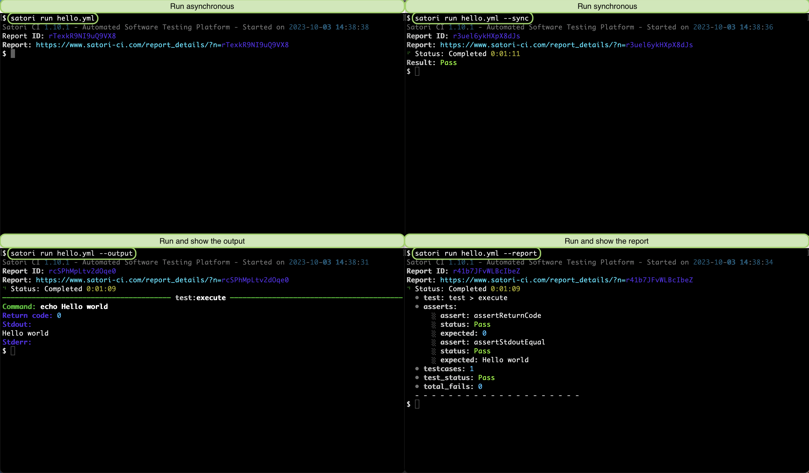
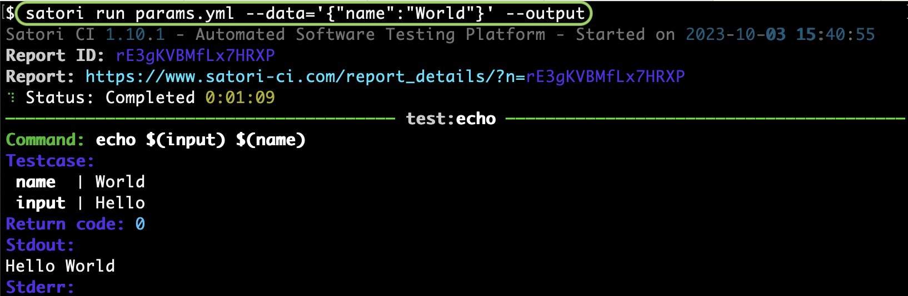
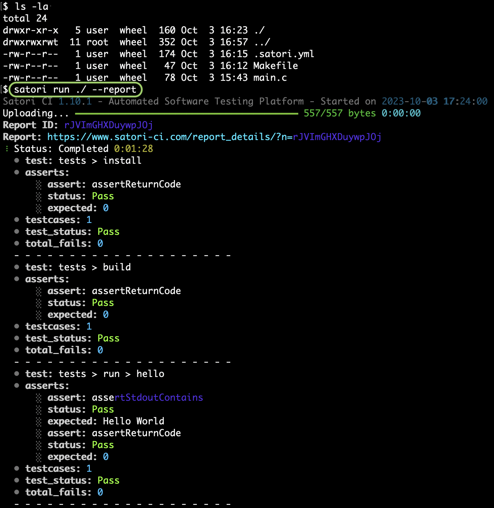
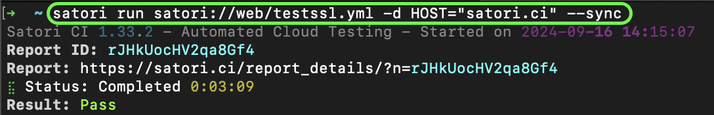
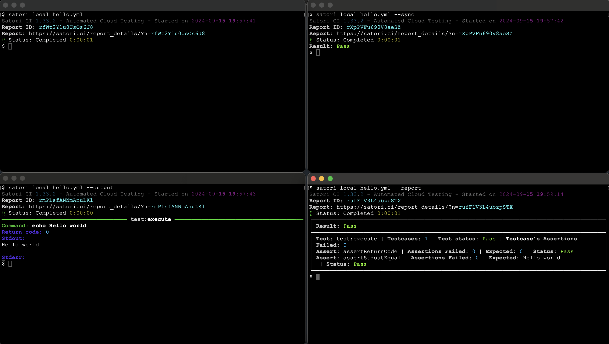
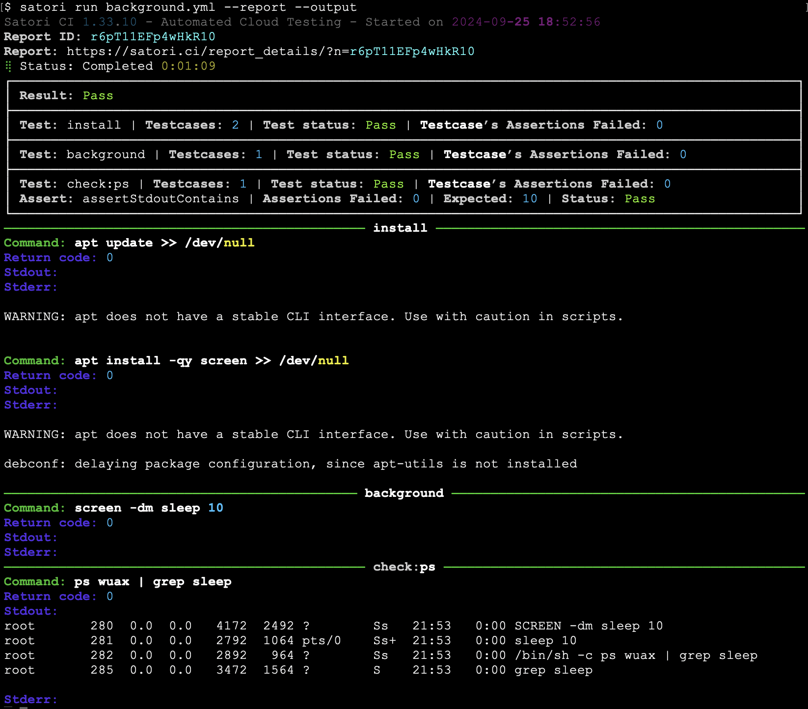

# Run

Satori can be executed in two environments:

**- Remotely:** run Satori on our cloud platform, which allows for scalable and centralized testing without the need for local resources.

**- Locally:** execute Satori on your local machine, providing flexibility for development and testing in a controlled environment.

## Run Remotely

This playbook named `hello.yml` remotely using Satori. This playbook is defined as follows:

```yml
test:
  assertStdoutEqual: "Hello world\n"
  assertReturnCode: 0

  execute:
    - echo Hello world
```
When executing this playbook, you have several options:

**- Asynchronously (no parameters):** run the playbook without any additional parameters.

**- Synchronously with `--sync`:** execute the playbook synchronously, displaying the status upon completion.

**- Synchronously with `--report`:** run the playbook synchronously and generate a report that summarizes the results when it finishes.

**- Synchronously with `--output`:** execute the playbook synchronously, showing the output in real-time as it completes.



## Run Remotely with Parameters

When creating playbooks in Satori, you can include parameters that need to be defined at runtime. If you use a $ symbol in your playbook for a parameter that is not explicitly defined within the playbook, it will be treated as a required parameter when the playbook is executed.

For example, consider the following playbook named `satori://test.yml`, which echoes the parameter ${{WHAT}}:

```yml
test:                                                                                                                                                                             
  assertStdoutContains: Hello World                                                                                                                                               
  hello:                                                                                                                                                                          
  - echo Hello World                                                                                                                                                              
  whatever:                                                                                                                                                                       
  - echo ${{WHAT}}
```
To execute this playbook and provide the required parameter, you would run the command:

```bash
satori-v2 run params.yml -d WHAT="Hello World" --output
```



## Local testing with Satori Playbooks

When working locally on a directory containing source code, you can save your playbook as `.satori.yml` within the directory. This approach is similar to how you would structure your repository when testing code through a CI pipeline.

Consider the following example files: `main.c`, a corresponding `Makefile`, and a playbook that verifies the expected behavior of your code.

- **main.c**:

```c
#include <stdio.h>

int main() {
    printf("Hello World\n");
    return 0;
}
```

- **Makefile**:

```c
all: hello

hello: main.c
	gcc -o hello main.c
```

- **.satori.yml**:

```yml
install:
  updates:
    - apt update >> /dev/null
  dependencies:
    - apt install -qy make gcc >> /dev/null

tests:
  assertReturnCode: 0
  build:
    - make
  run:
    assertStdoutContains: "Hello World"
    hello:
      - ./hello
```



This same playbook can also be employed in CI/CD environments. 

## Run a public Playbook

You can execute on-demand public playbooks available in the Satori platform. You can see a list of the publicly available playbooks with: 

::: warning On development
The `--public` flag of `satori-v2 playbooks` is not available yet in CLI v2. Use `satori-v2 playbooks` (optionally with `--json`) for now; the v1 syntax is kept here for reference.
:::

```sh
satori-v2 playbooks --public
```
To run a public playbook, you can execute them passing parameters if required with `-d`:

```sh
satori-v2 run satori://some/playbook.yml
```



This allows you to leverage existing public playbooks that may already address your specific testing needs effectively.

### Playbook aliases

CLI v2 ships shortcuts for the most common code-analysis playbooks. Passing one of these aliases as the `SOURCE` runs the corresponding public playbook against the **current directory**:

```sh
satori-v2 run semgrep     # same as: satori-v2 run ./ --playbook satori://code/semgrep.yml
satori-v2 run pyspector   # same as: satori-v2 run ./ --playbook satori://code/python/pyspector.yml
```

You can combine them with any other `run` option, for example `satori-v2 run semgrep --report --output`.

## Run Locally

You can execute the playbook named `hello.yml` locally, just as you would run it remotely. This allows you to verify that your playbook functions correctly in your local environment, and Satori will confirm the assertion results. Here’s how you can run it locally:

```sh
satori-v2 local hello.yml --sync
```


`satori-v2 local` accepts a subset of the `run` options: `-p/--playbook`, `-d/--data`, `--split`, `-df/--data-file`, `--timeout`, `--run`, `--visibility`, `-t/--tag`, `-o/--output`, `--report`, `--issues` and `-s/--sync`.

::: warning On development
The `local` flags `--test`, `--name`, `--format`, `--redacted`, `--save-report` and `--save-output` are not available yet in CLI v2.
:::

## Run a process in Background

When running a service that needs to listen in the background, it's important to ensure that processes do not remain in the foreground, especially when using shell scripting techniques. The recommended approach is to utilize screen, which allows you to run processes in a detached session. Additionally, setting a timeout for the container helps manage its lifecycle effectively. For example:

```yml
settings:
  name: Background process
  timeout: 60

install:
- apt update >> /dev/null
- apt install -qy screen >> /dev/null

background:
  - screen -dm sleep 10

check:
  assertStdoutContains: "10"
  ps:
    - ps wuax | grep sleep
```



The command `screen -dm` is used to start a new detached `screen` session in the background. This is useful for running commands or scripts in the background and continue executing additional commands to test the background service.

## Advanced Run Command Options

The `satori-v2 run` command provides extensive options for controlling execution behavior, environment configuration, and output handling.

### Playbook Selection and Data

| Flag | Description | Example |
| --- | --- | --- |
| `-p, --playbook SOURCE` | Run a playbook other than the one in `SOURCE` (e.g. a public `satori://` playbook against a local directory) | `satori-v2 run ./ -p satori://code/semgrep.yml` |
| `-d, --data KEY=VALUE` | Define a parameter and its value (repeatable). Multi-line values are split into one value per line | `satori-v2 run ./ -d API_KEY=secret -d HOST=example.com` |
| `--split KEY=DELIMITER` | Split the value of parameter `KEY` on `DELIMITER` so each part becomes a separate input value (repeatable) | `satori-v2 run ./ -d HOSTS="a.com,b.com" --split HOSTS=,` |
| `-df, --data-file KEY=PATH` | Load variable values from a file (repeatable). Each non-blank line becomes a value for `KEY` | `satori-v2 run ./ -df PAYLOAD=/path/to/data.txt` |
| `-e, --env KEY VALUE` | Set an environment variable inside the execution container (repeatable) | `satori-v2 run ./ -e DEBUG 1 -e LANG C.UTF-8` |
| `-t, --tag KEY VALUE` | Attach a tag to the job for later filtering (repeatable) | `satori-v2 run ./ -t team backend -t env staging` |

::: warning On development
The following file/data flags are not available yet in CLI v2. The v1 syntax is kept here for reference.
:::

| Flag | Description | Example |
| --- | --- | --- |
| `-i, --include FILE` | Include additional files in the execution context (repeatable) *(on development)* | `satori-v2 run ./ -i config.yaml -i data.json` |
| `--clone REPORT_ID` | Clone settings from an existing report *(on development)* | `satori-v2 run ./ --clone AOQxDWDkXpZp` |

### Execution Environment

| Flag | Description | Example |
| --- | --- | --- |
| `--cpu COUNT` | Set CPU units (256, 512, 1024, 2048, 4096, 8192, 16384) | `satori-v2 run ./ --cpu 2048` |
| `--memory MB` | Set memory allocation in MB (512, 1024, 2048, 3072, 4096, 5120, 6144, 7168, 8192, 9216, 10240, 11264, 12288, 13312, 14336, 15360, 16384, 17408, 18432, 19456, 20480, 21504, 22528, 23552, 24576, 25600, 26624, 27648, 28672, 29696, 30720, 32768, 36864, 40960, 45056, 49152, 53248, 57344, 61440, 65536, 73728, 81920, 90112, 98304, 106496, 114688, 122880) | `satori-v2 run ./ --memory 2048` |
| `--image IMAGE_NAME` | Specify custom Docker image | `satori-v2 run ./ --image ubuntu:22.04` |
| `--timeout SECONDS` | Maximum execution time. Defaults to the playbook `settings.timeout` when set | `satori-v2 run ./ --timeout 600` |
| `--expire EXPIRATION` | Expiration for the run and its data (the value is sent to the platform as provided) | `satori-v2 run ./ --expire EXPIRATION` |
| `-r, --region-filter REGION` | Restrict the execution to the given region(s) (repeatable) | `satori-v2 run ./ -r us-east-1 -r eu-west-1` |
| `--visibility {public\|private\|unlisted}` | Set the visibility of the run (default: private) | `satori-v2 run ./ --visibility public` |
| `--count NUMBER` | Number of parallel executions to launch (default: 1) | `satori-v2 run ./ --count 10` |

**Note:** when `--count` is greater than 1 and you also pass `--output` or `--live-output`, the CLI prints a warning and only the output of the **first** execution is shown. With `--report`, a summary table of all executions is shown instead of a single report.

CLI flags take precedence over the values defined in the playbook `settings:` section (`cpu`, `memory`, `image`, `timeout`).

::: warning On development
`--storage` and `--os` are not available yet as `satori-v2 run` flags. The `storage` playbook setting still works. The v1 syntax is kept here for reference.
:::

| Flag | Description | Example |
| --- | --- | --- |
| `--storage GB` | Set storage allocation in GB *(on development)* | `satori-v2 run ./ --storage 50` |
| `--os {windows\|linux}` | Select operating system *(on development)* | `satori-v2 run ./ --os linux` |

### Scheduling and Monitoring

In CLI v2 the schedule is defined **in the playbook**, not on the command line. When the playbook passed to `satori-v2 run` has a `settings.cron`, `settings.rate` or `settings.monitor` entry, the command creates a [monitor](monitor.md) instead of a one-off run:

```yml
settings:
  name: Website check
  rate: 10 minutes

test:
  assertStdoutContains: HTTP/2 200
  curl:
    - curl -is https://satori.ci
```

```sh
satori-v2 run monitor.yml    # creates a monitor that runs every 10 minutes
```

Options such as `-d`, `-e`, `-t`, `-r`, `--cpu`, `--memory`, `--image`, `--timeout` and `--visibility` are applied to the monitor as well. See [Monitor](monitor.md) for how to manage it afterwards.

::: warning On development
The `--rate` and `--cron` flags of `satori-v2 run` are not available yet in CLI v2; use the playbook settings shown above. The v1 syntax is kept here for reference.
:::

| Flag | Description | Example |
| --- | --- | --- |
| `--rate EXPRESSION` | Create monitor with rate-based scheduling *(on development)* | `satori-v2 run ./ --rate "every 5 minutes"` |
| `--cron EXPRESSION` | Create monitor with cron schedule *(on development)* | `satori-v2 run ./ --cron "0 * * * *"` |
| `--count NUMBER` | Number of executions for monitor *(on development, `--count` currently applies to runs only)* | `satori-v2 run ./ --rate "every 5 minutes" --count 10` |

**Note:** `--rate` and `--cron` are mutually exclusive. Use one or the other to create scheduled monitors.

### Repository Scanning

Use `--repo` to clone a GitHub repository at execution time and run a playbook against its contents. This is useful for running code analysis, linting, secret detection, or any playbook that needs source code without having to clone the repository locally first.

The format is `user/repo` (GitHub shorthand):

```sh
satori-v2 run satori://secrets/all.yml --repo BonJarber/SecretsTest --report --output
```

This clones the `BonJarber/SecretsTest` repository and runs the secrets scanner against it.

Under the hood, `satori-v2 run ... --repo owner/repo` creates a [scan](scan.md) job limited to the latest commit of the repository (the same as `satori-v2 scan owner/repo SOURCE -q 1`). The job is therefore listed by `satori-v2 scans` and can be managed with `satori-v2 scan ID`. `--sync`, `--output`, `--report`, `--stdout` and `--stderr` work as with a regular run; `--count`, `--files`, `--save-files`, `--delete-report`, `--delete-output` and `--expire` do not apply to repository runs.

You can also combine `--repo` with additional parameters:

```sh
satori-v2 run satori://code/python/lint/ruff.yml --repo satorici/satori-cli --report --output
satori-v2 run satori://code/go/gosec.yml --repo securego/gosec --report --output
satori-v2 run satori://code/github/ghwfauditor.yml -d GITHUB_PAT=TBC --repo All-Hands-AI/OpenHands --report --output
```

| Flag | Description | Example |
| --- | --- | --- |
| `--repo, --repository REPO` | Clone a GitHub repository and run the playbook against its latest commit | `satori-v2 run satori://code/semgrep.yml --repo user/repo --report --output` |

### Output and Report Control

| Flag | Description | Example |
| --- | --- | --- |
| `-s, --sync` | Wait until the run finishes, showing its status | `satori-v2 run ./ --sync` |
| `-o, --output` | Wait for the run and show the output of each command (stdout, stderr, return code, time) | `satori-v2 run ./ --output` |
| `--live-output` | Stream the execution output while the run is in progress | `satori-v2 run ./ --live-output` |
| `--report` | Wait for the run and show the report with the assertion results | `satori-v2 run ./ --report` |
| `--issues` | Wait for the run and list issues for the execution (only when `--count` is 1) | `satori-v2 run ./ --issues` |
| `--stdout` | Wait for the run and print the raw stdout of the execution | `satori-v2 run ./ --stdout` |
| `--stderr` | Wait for the run and print the raw stderr of the execution | `satori-v2 run ./ --stderr` |
| `-f, --files` | Wait for the run and download the files generated by the execution | `satori-v2 run ./ --files` |
| `--save-files` | Keep the files generated by the execution on the platform without downloading them now (retrieve them later with `satori-v2 report ID files`) | `satori-v2 run ./ --save-files` |
| `--delete-report` | Do not store the report on Satori servers | `satori-v2 run ./ --delete-report` |
| `--delete-output` | Do not store the command output on Satori servers | `satori-v2 run ./ --delete-output` |
| `--json` | Print the job information as JSON | `satori-v2 run ./ --json` |

**Deprecated:** `--save-report true|false` and `--save-output true|false` still work in CLI v2 but print a deprecation warning. They are the inverse of the new flags: `--save-report false` is equivalent to `--delete-report`, and `--save-output false` to `--delete-output`. The v1 `PATH` form (saving the report or output to a local file) is not supported.

::: warning On development
The following output flags are not available yet in CLI v2. The v1 syntax is kept here for reference.
:::

| Flag | Description | Example |
| --- | --- | --- |
| `--format {plain\|md}` | Set output format (plain text or Markdown) *(on development, `--format` is currently only available on `report ID output`)* | `satori-v2 run ./ --sync --output --format md` |
| `--redacted PARAM` | Mark parameters as redacted in logs (repeatable) *(on development, use the `redacted` playbook setting)* | `satori-v2 run ./ --redacted API_KEY --redacted PASSWORD` |
| `--test TEST_NAME` | Show only the output of a given test *(on development, available on `report ID output --test`)* | `satori-v2 run ./ --output --test hello` |
| `--name NAME` | Override the playbook name *(on development)* | `satori-v2 run ./ --name "Nightly build"` |
| `--save-report {true\|false\|PATH}` | Save report to file or default location *(deprecated, see above)* | `satori-v2 run ./ --save-report true` |
| `--save-output {true\|false\|PATH}` | Save command output to file *(deprecated, see above)* | `satori-v2 run ./ --save-output ./output.log` |

### Complete Example with Multiple Options

```sh
satori-v2 run ./ \
  -p satori://code/semgrep.yml \
  -d API_KEY=secret \
  -e DEBUG 1 \
  -t team backend \
  --cpu 4096 \
  --memory 8192 \
  --timeout 600 \
  -r us-east-1 \
  --sync \
  --report \
  --output \
  --delete-output
```

This command runs the public Semgrep playbook against the current directory with:
- Secret parameter `API_KEY`
- Environment variable `DEBUG=1` inside the container
- The job tagged with `team=backend`
- 4 vCPU and 8GB memory
- 10-minute timeout
- Execution restricted to the `us-east-1` region
- Synchronous execution with report and output
- Command output not stored on Satori servers

The v1 example is kept below for reference; the flags marked above as on development (`-i`, `--format`, `--redacted`, `--save-report`) do not work yet in CLI v2:

```sh
satori-v2 run ./ \
  -d API_KEY=secret \
  -i config.yaml \
  --cpu 4 \
  --memory 2048 \
  --timeout 600 \
  --sync \
  --report \
  --output \
  --format md \
  --redacted API_KEY \
  --save-report true
```
