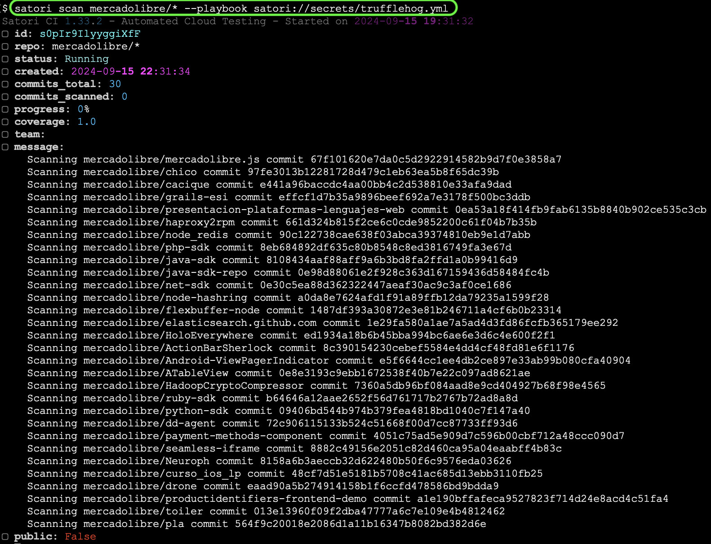
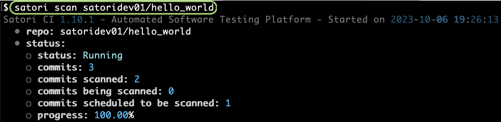
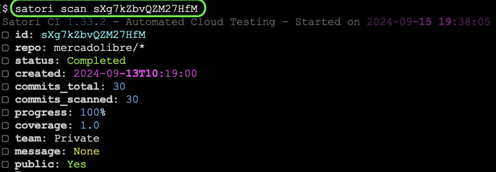
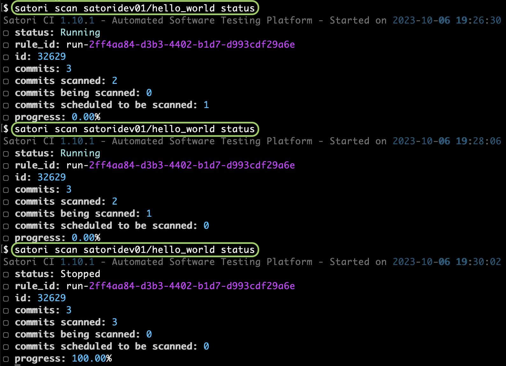
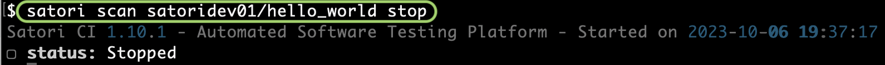
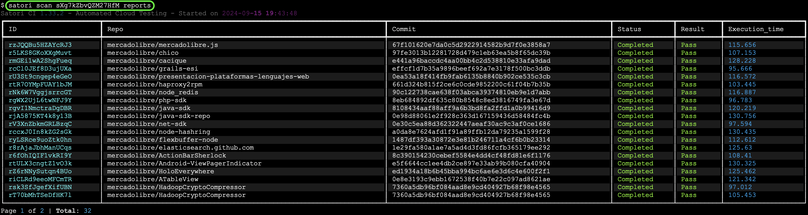
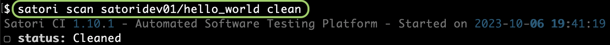

# Scan

You can run a playbook on all the repositories of a Github account or on all the commits of a repository

Whenever you want to run an execution on each of the individual commits of a repository, you can use the scan functionality.

## Scan Github Account Repositories

```sh
satori scan githubUsername/* --playbook satori://whatever
```

Example:



## Scan Github Repository Commits

If you target a repo, the optional parameter `-c` is used to indicate the percentage of repository commits to include in the scan. For example `-c 1` will scan 1% of the repository commits if you only want to take a sample. This is useful for sampling large repositories:

```sh
satori scan githubUsername/repository
```

Example:



If you however want to be sure that everything was tested, you can target full scan coverage on all the repository commits, you would:

```sh
satori scan githubUsername/repository -c 100
```

You can see how the results of your playbook affect different commits and forks of your repository.

## Scan Information

If need to get the status of a scan, you can reference its id with:

```sh
satori scan ID
```

Example:



### Scan Status

Since normally repositories have a lot of commits, you may want to check what the execution status is with this command:

```sh
satori scan githubUsername/repository status
```



It shows the current status, the amount of commits found, which ones were scanned, which ones are being scanned and which ones are scheduled to be scanned. Since no scan is being run at the time of executing this command, there is no progress but in other cases it would be a percentage.

### Scan Stop

If at any point you want to cancel the scan, you use the `stop` action:

```sh
satori scan githubUsername/repository stop
```

Example:



### Scan Reports

You can list the reports associated to a scan by running the command:

```sh
satori scan ID reports
```

Example:



### Scan Clean

> [!WARNING]
> This command will delete all the reports associated to a certain repository:

```sh
satori scan githubUsername/repository clean
```

Example:


