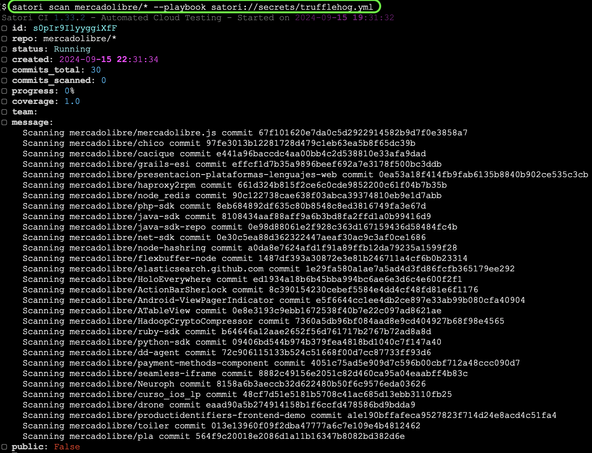
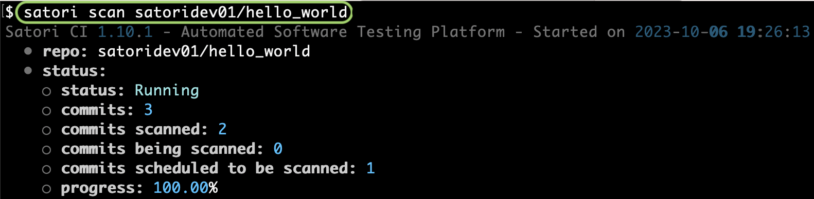
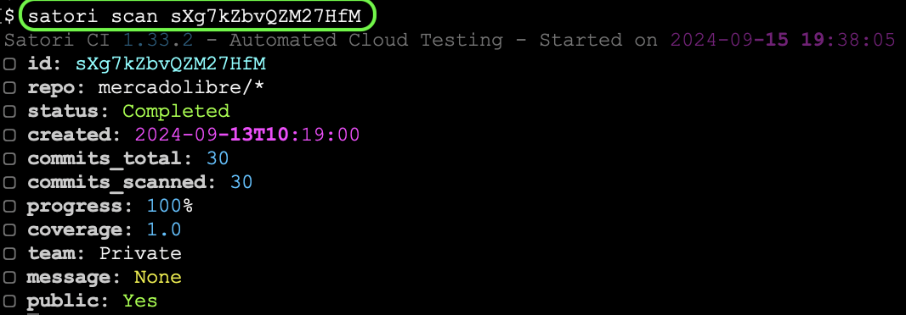
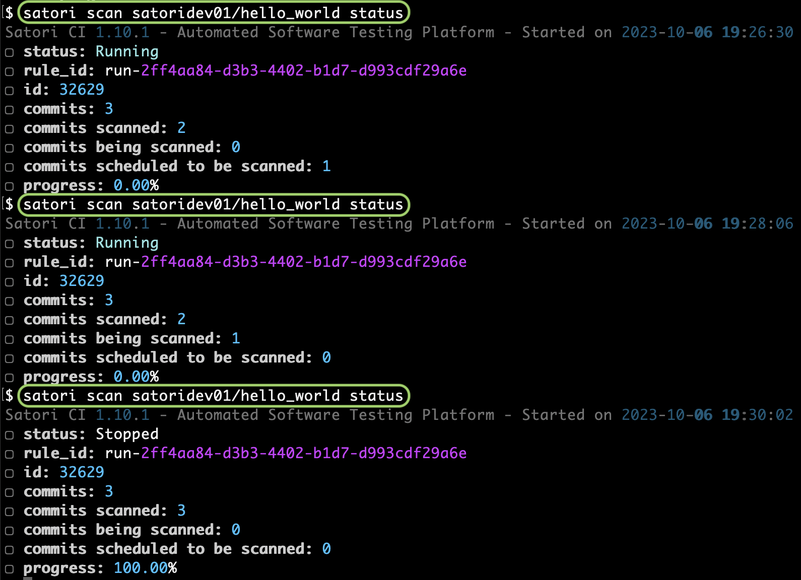
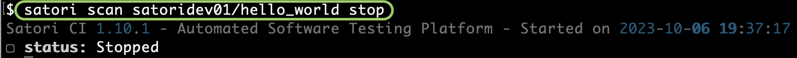
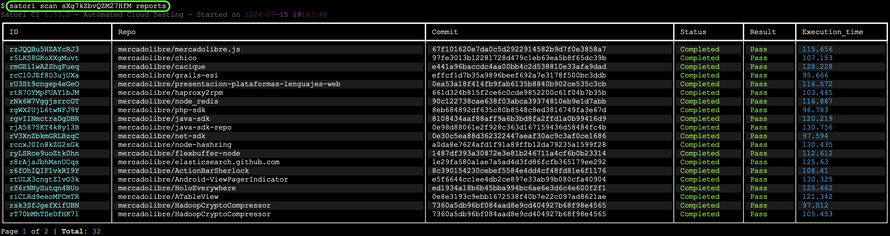
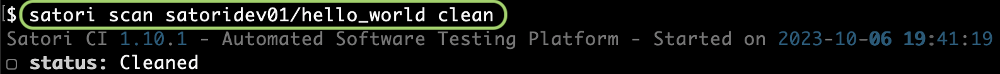

# Scan

You can run a playbook on all the repositories of a Github account or on all the commits of a repository

Whenever you want to run an execution on each of the individual commits of a repository, you can use the scan functionality.

## Create a Scan

In CLI v2 a scan always needs a repository **and** a playbook. The playbook can be given as the second positional argument or with `-p/--playbook`:

```sh
satori-v2 scan githubUsername/repository satori://code/semgrep.yml
satori-v2 scan githubUsername/repository --playbook satori://code/semgrep.yml
satori-v2 scan githubUsername/repository .satori.yml
```

The `SOURCE` can be a public `satori://` playbook or a local `.yml` file. Directories are not accepted as scan sources (use `satori-v2 run ./ --repo owner/repo` to run a local directory playbook against a repository instead).

## Scan Github Account Repositories

::: warning On development
Scanning every repository of an account with a `user/*` wildcard target is not confirmed to work in CLI v2 yet. The v1 syntax is kept here for reference.
:::

```sh
satori-v2 scan githubUsername/* --playbook satori://whatever
```

Example:



## Scan Github Repository Commits

If you target a repo, the optional parameter `-q/--quantity` indicates how many of the repository commits (starting from the latest) to include in the scan. For example `-q 1` scans only the latest commit, which is exactly what `satori-v2 run PLAYBOOK --repo owner/repo` does. This is useful for sampling large repositories:

```sh
satori-v2 scan githubUsername/repository satori://code/semgrep.yml -q 10
```

Example:



If you omit `-q`, the scan covers the repository commits without limit.

::: warning On development
The v1 `-c PERCENTAGE` flag (percentage of commits to scan) has been replaced by `-q/--quantity N` (number of commits) in CLI v2. The v1 syntax is kept here for reference.
:::

```sh
satori-v2 scan githubUsername/repository
satori-v2 scan githubUsername/repository -c 100
```

You can see how the results of your playbook affect different commits and forks of your repository.

## Scan Information

If need to get the status of a scan, you can reference its id with:

```sh
satori-v2 scan ID
```

Add `--json` to get the information as JSON. To list all your scans use `satori-v2 scans` (supports `--json`, `--page`, `-q/--quantity` and `--public`).

Example:



### Scan Status

Since normally repositories have a lot of commits, you may want to check what the execution status is with this command:

```sh
satori-v2 scan ScanID status
```



It shows the current status, the amount of commits found, which ones were scanned, which ones are being scanned and which ones are scheduled to be scanned. Since no scan is being run at the time of executing this command, there is no progress but in other cases it would be a percentage.

### Scan Stop

If at any point you want to cancel the scan, you use the `stop` action:

```sh
satori-v2 scan ScanID stop
```

Example:



### Scan Reports

The reports (executions) of a scan can be listed with the generic reports command, passing the scan ID:

```sh
satori-v2 reports ScanID
```

::: warning On development
`satori-v2 scan ID reports` (with its `-p`/`-l` pagination flags) is not available yet in CLI v2; use `satori-v2 reports ScanID` shown above. The v1 syntax is kept here for reference.
:::

```sh
satori-v2 scan ID reports
```

Example:



### Scan Clean

> [!WARNING]
> This command will delete all the reports associated to a scan:

```sh
satori-v2 scan ScanID clean
```

Example:



::: warning On development
In CLI v2 `clean` takes the numeric scan ID rather than the `user/repository` name, and the `--delete-commits` flag is not available yet. The v1 syntax is kept here for reference.
:::

```sh
satori-v2 scan githubUsername/repository clean
satori-v2 scan githubUsername/repository clean --delete-commits
```

### Scan Delete

To delete a scan once it is finished or stopped:

```sh
satori-v2 scan ScanID delete
```

## Advanced Scan Options

The `satori-v2 scan` command provides extensive options for controlling scanning behavior and filtering results.

### Data and Configuration

| Flag | Description | Example |
| --- | --- | --- |
| `-p, --playbook SOURCE` | Playbook to run on each commit (alternative to the positional `SOURCE`) | `satori-v2 scan user/repo --playbook satori://code/semgrep.yml` |
| `-q, --quantity NUMBER` | Number of commits to scan, starting from the latest | `satori-v2 scan user/repo semgrep.yml -q 20` |
| `-d, --data KEY=VALUE` | Define parameters and their values (repeatable) | `satori-v2 scan user/repo semgrep.yml -d API_KEY=secret` |
| `--split KEY=DELIMITER` | Split the value of parameter `KEY` on `DELIMITER` into several input values | `satori-v2 scan user/repo pb.yml -d HOSTS=a,b --split HOSTS=,` |
| `-e, --env KEY VALUE` | Set an environment variable in the execution container (repeatable) | `satori-v2 scan user/repo pb.yml -e DEBUG 1` |

### Execution Environment

| Flag | Description | Example |
| --- | --- | --- |
| `--cpu COUNT` | CPU units for the container | `satori-v2 scan user/repo pb.yml --cpu 2048` |
| `--memory MB` | Memory for the container in MB | `satori-v2 scan user/repo pb.yml --memory 4096` |
| `--image IMAGE` | Custom Docker image | `satori-v2 scan user/repo pb.yml --image python:3.12` |
| `-r, --region-filter REGION` | Restrict executions to the given region(s) (repeatable) | `satori-v2 scan user/repo pb.yml -r us-east-1` |

CLI flags take precedence over the `cpu`, `memory` and `image` values of the playbook `settings`.

### Execution Control

| Flag | Description | Example |
| --- | --- | --- |
| `-s, --sync` | Wait for scan to complete | `satori-v2 scan user/repo pb.yml -s` |
| `--visibility {public\|private\|unlisted}` | Set scan visibility (default: private) | `satori-v2 scan user/repo pb.yml --visibility public` |
| `--json` | Print the scan job as JSON | `satori-v2 scan user/repo pb.yml --json` |

::: warning On development
The following v1 options and subcommands are not available yet in CLI v2. The v1 syntax is kept here for reference.
:::

#### Branch and Date Filtering

| Flag | Description | Example |
| --- | --- | --- |
| `-b, --branch BRANCH` | Scan specific branch (default: main) *(on development)* | `satori-v2 scan user/repo -b develop` |
| `--from YYYY-MM-DD` | Start date for scanning commits *(on development)* | `satori-v2 scan user/repo --from 2024-01-01` |
| `--to YYYY-MM-DD` | End date for scanning commits *(on development)* | `satori-v2 scan user/repo --to 2024-12-31` |

#### Output and Checks

| Flag | Description | Example |
| --- | --- | --- |
| `-c PERCENTAGE` | Percentage of commits to scan *(replaced by `-q/--quantity`)* | `satori-v2 scan user/repo -c 100` |
| `-o, --output` | Display command output *(on development)* | `satori-v2 scan user/repo -s --output` |
| `-r, --report` | Display test results *(on development; in v2 `-r` is `--region-filter`)* | `satori-v2 scan user/repo -s --report` |
| `--skip-check` | Skip repository existence check *(on development)* | `satori-v2 scan user/repo --skip-check` |

#### Subcommands

| Command | Description | Example |
| --- | --- | --- |
| `scan ID reports [-p N] [-l N]` | List the reports of a scan *(on development, use `satori-v2 reports ID`)* | `satori-v2 scan ID reports -l 50` |
| `scan ID clean --delete-commits` | Delete commit records during cleanup *(on development)* | `satori-v2 scan ID clean --delete-commits` |
| `scan ID visibility VALUE` | Change the visibility of a scan *(on development)* | `satori-v2 scan ID visibility public` |
| `scan ID check-commits` | Refresh the list of commits of the repository *(on development)* | `satori-v2 scan ID check-commits` |
| `scan ID check-forks` | Refresh the list of forks of the repository *(on development)* | `satori-v2 scan ID check-forks` |

### Complete Scan Example

```sh
satori-v2 scan user/repo satori://code/semgrep.yml \
  -q 50 \
  -d API_KEY=my-secret-key \
  -e SEMGREP_TIMEOUT 300 \
  --cpu 2048 \
  --memory 4096 \
  -r us-east-1 \
  --sync \
  --visibility private
```

This command:
- Scans the latest 50 commits of the repository
- Provides an API key as a parameter and an environment variable to the container
- Uses the Semgrep playbook with 2 vCPU and 4GB memory in `us-east-1`
- Waits for completion
- Sets visibility to private

The v1 example is kept below for reference; `-c`, `-b`, `--from`, `--to` and `--report` are on development in CLI v2:

```sh
satori-v2 scan user/repo \
  -c 50 \
  -b develop \
  --from 2024-01-01 \
  --to 2024-12-31 \
  -d '{"API_KEY":"my-secret-key"}' \
  --playbook satori://code/semgrep.yml \
  --sync \
  --report \
  --visibility private
```
