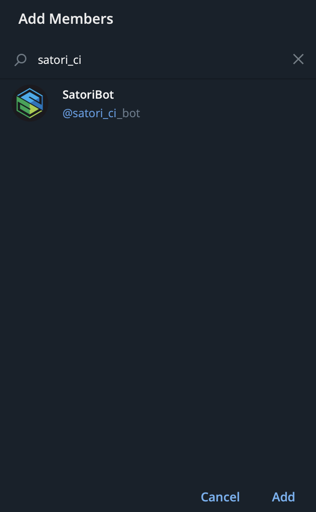
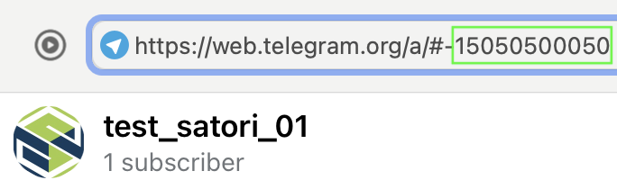

# Notifications

Our flexible notification system ensures that your team stays informed about the status of your projects in real-time. We offer integration with multiple communication platforms, including:

- [Slack](#slack)
- [Discord](#discord)
- [Email](#email)
- [Telegram](#telegram)
- [Datadog](#datadog)
- Jira
- GitHub Issues

You can define the specific conditions under which you wish to receive updates—whether on test failures, successes, or both. 

## Notification settings

You can configure notifications using either the web interface or the CLI.

### Via CLI

To view your current notification settings, run the following command:

```sh
satori team Private settings
```


### Via Web 

You can also set up notifications using the web interface by completing the necessary fields in the Notifications section of the Satori web [dashboard.](https://www.satori.ci/dashboard/)

1. Log in to the Satori web dashboard.
2. Navigate to the Team > Settings section.
3. Fill in the required fields for your notification preferences (e.g., email, Slack, Discord, etc.).
4. Save your settings to activate notifications for your project.


## Playbook Settings

To configure your notification preferences, start by defining your **Playbook Settings**. In this section, you can choose how you want to be notified about your tests—whether for every event (`log`), only on failures (`logOnFail`), or only on successes (`logOnPass`). You can specify your preferred notification channels, including email, Slack, Datadog, or Discord.

### Example Configuration

You can set your notification preferences in YAML format as follows:

```yml
settings:
  log|logOnFail|logOnPass: email|slack|discord|datadog

[...]
```
For example, to receive notifications on Slack only when a test fails, you would configure your settings like this:

```yml
settings:
  logOnFail: slack

[...]
```

## Configuring Notifications

### Email

To set up email notifications, use this command:

```sh
satori team Private set_config notification_email your@email.com
```


### Slack

To set up Slack notifications in Satori, follow these steps to retrieve your workspace and channel IDs:

Steps to Retrieve Workspace and Channel ID:

1. Open the web version of Slack and navigate to the channel you're interested in.
2. In your browser’s URL bar, you’ll see a URL like this: https://app.slack.com/client/T00000000/C00000000. The part after '/client/' is split into two segments.
3. In the Satori CI dashboard, go to Team > Settings.
4. Enter the first segment of the URL (e.g., T00000000) in the Workspace ID field.
5. Insert the Channel ID (e.g., C00000000) in the Default Channel field to receive notifications.
6. Select Add Satori to Workspace and follow the instructions on the Slack website to add the bot.
7. In Slack, invite the bot to the channel by typing /invite @SatoriCIBot.

Or via the CLI command: 

```sh
satori team Private set_config slack_workspace TXXXXXXXXXX
```


```sh
satori team Private set_config slack_channel CXXXXXXXXXX
```


### Discord

To set up Discord notifications in Satori-CI, you first need to obtain the Channel ID. Follow these steps:

**Enabling Developer Mode:**
1. Open your Discord settings by clicking the gear icon in the bottom left corner, next to your username and avatar.
2. In the settings menu, select Appearance under the App Settings category.
3. Scroll down to the Advanced section and toggle on Developer Mode.

**Obtaining the Channel ID:**
1. Right-click the desired channel name in Discord.
2. Select Copy ID from the dropdown menu. The Channel ID is now copied to your clipboard.
*Note: This method can be used to obtain IDs for text channels, voice channels, categories, and individual messages.*

Once you have the Channel ID, you can configure it in Satori Web or with the following command:

```sh
satori team Private set_config discord_channel CHANNEL_ID
```


### Telegram

To set up Telegram notifications with Satori, follow these steps:

1. Create a Telegram Channel: ensure you have a Telegram channel and invite the @satori_ci_bot to your team.


2. Obtain the Channel ID: access your channel via the web at Telegram Web. The Channel ID is the number that appears after the # in the URL (e.g., -15050500050).
Once you have the Channel ID, you can configure it in Satori-CI to start receiving notifications.


```sh
satori team Private set_config telegram_channel CHANNEL_ID
```

### Datadog

Satori-CI integrates with Datadog Events for notification management. To set this up, you'll need to create an **API Key** and specify the **Site Region** from Datadog.

#### Step 1: Create an API Key
1. Navigate to **Organization Settings** in your Datadog account.
2. Go to **API Keys**.
3. Click on **+ New Key** to create a new API key for Satori.

#### Step 2: Configure the API Key in Satori-CI
Use the Satori CLI to configure your newly created API key with the following command:

```shell
satori team {MySatoriTeam} set_config datadog_api_key {MyDatadogApiKey}
```

- Replace `{MySatoriTeam}` with your Satori team name.
- Replace `{MyDatadogApiKey}` with your Datadog API key.

#### Step 3: (Optional) Configure Site Region
By default, events are sent to the **us1** site region. To configure a different site region, use the following command:

```shell
satori team {MySatoriTeam} set_config datadog_site {MyDatadogRegion}
```
- Replace `{MyDatadogRegion}` with one of the following options: `us1`, `us3`, `us5`, `eu`, `ap1`, or `us1-fed`.

Via CLI with the following command: 
```sh
satori team Private set_config datadog_api_key a123
```


```sh
satori team Private set_config datadog_site us3|eu|etc
```


## Report notifications

To receive a copy of your test report in PDF format along with your notifications, you can specify this in your **Playbook Settings**.

```yml
settings:
  onLogFail: slack
  report: pdf
```

If you wish to prevent the generation of any reports, you can set the report option to false. This will ensure that all generated outputs are deleted:

```yml
settings:
  onLogFail: slack 
  report: false 
```
