# Notifications

::: warning On development
The `satori-v2 settings` and `satori-v2 team ... set_config` commands used below to configure **team default** notification channels are not available yet in CLI v2. Configure Slack bot membership from the web [dashboard](https://www.satori.ci/dashboard/) in the meantime.

Playbook `settings.notify`, the CLI `satori-v2 run --notify` flag, and `satori-v2 search --notify` **are available** in CLI v2 (Slack destinations only for now). The older playbook keys `log` / `logOnFail` / `logOnPass` are not used by v2 — migrate to `settings.notify`.
:::

Our flexible notification system ensures that your team stays informed about the status of your projects in real-time. We offer integration with multiple communication platforms, including:

- [Slack](#slack)
- [Discord](#discord)
- [Email](#email)
- [Telegram](#telegram)
- [Datadog](#datadog)

You can define the specific conditions under which you wish to receive updates—whether on test failures, successes, or both. 

## Notification settings

You can configure notifications using either the web interface or the CLI.

### Via CLI

To view your current notification settings, run the following command:

```sh
satori-v2 team Private settings
```

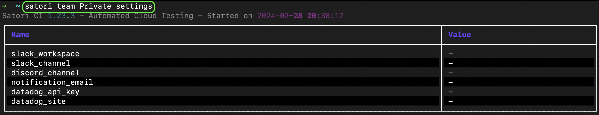

### Via Web 

You can also set up notifications using the web interface by completing the necessary fields in the Notifications section of the Satori web [dashboard.](https://www.satori.ci/dashboard/)

1. Log in to the Satori web dashboard.
2. Navigate to the Team > Settings section.
3. Fill in the required fields for your notification preferences (e.g., email, Slack, Discord, etc.).
4. Save your settings to activate notifications for your project.

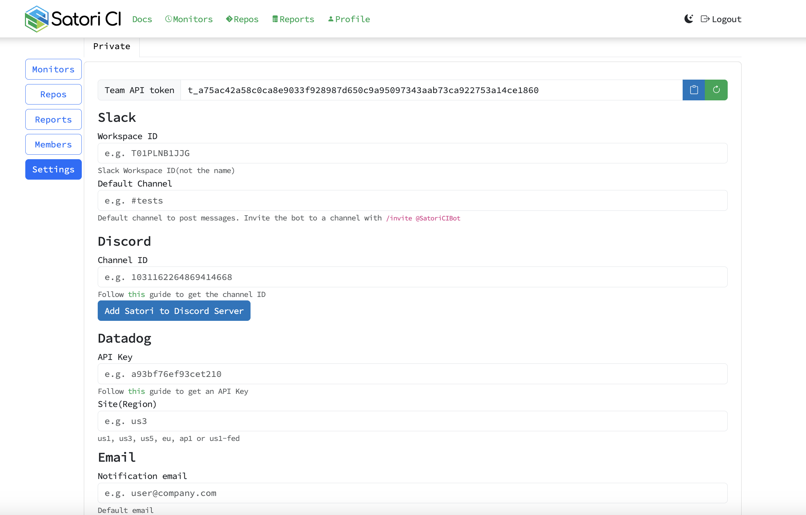

## Interactive Configuration with `satori-v2 settings`

Satori CLI provides an interactive command to easily configure all notification settings. The command supports three modes of operation: interactive menu, viewing current configuration, and direct configuration.

### Interactive Mode (Guided Setup)

The interactive mode opens a menu with step-by-step instructions for each integration:

```sh
satori-v2 settings
```

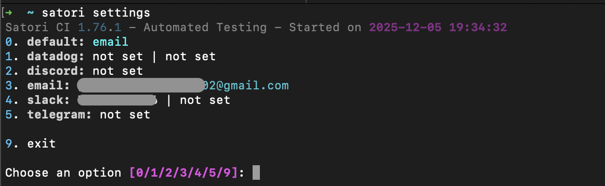

This command opens an interactive menu where you can:

1. **Set default notification method** - Choose which channel (slack, discord, email, telegram, datadog) should be used by default, or disable default notifications
2. **Configure Datadog** - Enter your Datadog API key and select your region (us1, us3, us5, eu1, ap1, ap2, us1-fed)
3. **Configure Discord** - Add the Satori bot to your Discord server and enter the channel ID
4. **Configure Email** - Set notification email addresses (comma-separated for multiple emails)
5. **Configure Slack** - Authorize the Satori bot in your workspace and configure workspace/channel IDs
6. **Configure Telegram** - Add the Satori bot to your Telegram channel and enter the channel ID

The command provides step-by-step instructions for each integration, including links to authorization pages and detailed setup guides.

### View Current Settings

You can view the current value of any notification setting by providing the key name:

```sh
# View default notification method
satori-v2 settings default

# View the current value of any notification setting 
satori-v2 settings KEY

```

**Available keys:** `default`, `datadog_api_key`, `datadog_site`, `discord`, `email`, `slack_workspace`, `slack_channel`, `telegram`

### Set Values Directly

You can configure notification settings directly from the command line without using the interactive menu:

```sh
# Set default notification method
satori-v2 settings default slack

# Configure email addresses
satori-v2 settings email user@example.com

# Configure Slack workspace
satori-v2 settings slack_workspace T1234567

# Configure Slack channel
satori-v2 settings slack_channel C1234567

# Configure Discord channel ID
satori-v2 settings discord 1234567890

# Configure Datadog API key
satori-v2 settings datadog_api_key abc123def456

# Configure Datadog site region
satori-v2 settings datadog_site us3

# Configure Telegram channel ID
satori-v2 settings telegram -1234567890
```

### Team-Specific Configuration

All modes support team-specific configuration using the `--team` flag:

```sh
# Interactive mode for a specific team
satori-v2 settings --team MyTeam

# View team settings
satori-v2 settings default --team MyTeam

# Configure team settings
satori-v2 settings email team@example.com --team MyTeam

# Alternative: using team command alias
satori-v2 team MyTeam settings
```

After configuring settings, the changes are applied immediately to your team.

## Playbook Settings

Define when and where to notify with a `settings.notify` list. Each rule has:

| Field | Required | Description |
| --- | --- | --- |
| `result` | no | `fail` or `pass` — when the rule applies. Omitted matches both. |
| `to` | yes | Destination URI (see below) |
| `severity` | no | List of named levels. On fail, the rule matches if **any** listed level appears in the execution report. Ignored when the run passed. |
| `watch` | no | When the rule fires: `finish` (the execution finished) and/or `issue-status` (an issue changed status). Without `watch`, the rule fires on finish only. See [Watching issue status](#watching-issue-status). |

Named severities (case-insensitive): `info`, `low`, `medium`, `high`, `critical`, `blocker`.

### Destination URIs

| Scheme | Format | Notes |
| --- | --- | --- |
| Slack | `slack://WORKSPACE:CHANNEL` or `slack://WORKSPACE/CHANNEL` | Channel may be a Slack channel ID (`C…`) or `#name`. Invite `@SatoriCIBot` to the channel. **Sending is supported now.** |
| Email | `email://user@example.com` | Accepted in config; delivery not implemented yet in v2. |

Multiple rules are allowed. Matching rules for Slack are sent at the end of each finished execution. The Slack message includes pass/fail, fail counts, severity summary, and links to the job and report on `https://dashboard.satori.ci`.

### Example

```yml
settings:
  notify:
    - result: fail
      severity: [high, critical, blocker]
      to: slack://T00000000:C00000000
    - result: pass
      to: slack://T00000000:C11111111
```

Notify on any failure (no severity filter):

```yml
settings:
  notify:
    - result: fail
      to: slack://T00000000:C00000000
```

Notify on finish regardless of pass or fail:

```yml
settings:
  notify:
    - to: slack://T00000000:C00000000
```

### Watching issue status

`watch` lists the events that fire a rule:

| `watch` | Sent when |
| --- | --- |
| omitted | the execution finishes |
| `[finish]` | the execution finishes |
| `[issue-status]` | an issue is marked True Positive / TP (not on finish) |
| `[issue-status, finish]` | both |

An `issue-status` event happens when an issue (finding) of the execution is marked True Positive (`TP`), for example after `satori-v2 issue <id> status TP` or `satori-v2 issue <id> verify`. Other status changes (FP, investigating, etc.) do not notify. For these events:

- `result` is checked against the execution the issue belongs to.
- `severity` is checked against the **issue's** severity, not the report totals. An issue without a severity does not match a rule that sets `severity`.
- To avoid repeated messages on every run, the new status is compared with the last triaged status (anything but `OPEN`) of the same issue in an earlier execution of the same repository and playbook. If it's the same, nothing is sent.

```yml
settings:
  notify:
    - watch: [issue-status]
      result: fail
      severity: [blocker, critical, high]
      to: slack://T00000000:C00000000
```

The Slack message includes the issue title, the old and new status, the severity, the repository and a link to the report.

### CLI override: `--notify`

On `satori-v2 run`, `--notify` is repeatable. When present, the CLI rules **replace** playbook `settings.notify` for that run (they do not merge).

```sh
satori-v2 run ./ \
  --notify 'severity=blocker,critical,high,result=fail,to=slack://T00000000:C00000000' \
  --notify 'result=pass,to=slack://T00000000:C11111111'
```

Each value is a comma-separated `key=value` string:

- Required: `to=<uri>`
- Optional: `result=pass|fail` (omitted matches both)
- Optional: `severity=blocker,critical,high` (comma-separated levels until the next key)
- Optional: `watch=issue-status,finish` (either or both; defaults to finish only, see [Watching issue status](#watching-issue-status))
- `status=…` is accepted but ignored

Notify only when a blocker, critical or high issue is marked True Positive:

```sh
satori-v2 run ./ --repo owner/repo \
  --notify 'watch=issue-status,severity=blocker,critical,high,result=fail,to=slack://T00000000:C00000000'
```

See also [Run command options](modes/run.md#execution-environment).

### Search: `--notify`

On `satori-v2 search`, `--notify` is repeatable and takes a bare Slack URI (`slack://workspace:channel`). It is **not** a job rule: the API sends the **current page** of search results to Slack as a monospace table (Id, Playbook source, Status, Result, Created at), and still prints the table in the terminal.

```sh
satori-v2 search --playbook satori://code/python/pyspector.yml \
  --notify slack://T00000000:C00000000
```

- Requires an authenticated session (anonymous search cannot notify)
- Empty result pages are not sent
- Invalid URIs fail the request with an error; Slack delivery failures are best-effort and do not hide the listing
- Does not apply to `--download`, `--reports`, `--stop`, or `--delete`

See also [Search](modes/executions.md#search).

### Legacy keys

`log`, `logOnFail`, and `logOnPass` (channel type names without URIs) are **not** applied by CLI v2. Prefer `settings.notify` with explicit `to` URIs.

## Configuring Notifications

### Email

To set up email notifications, use this command:

```sh
satori-v2 team Private set_config notification_email your@email.com
```

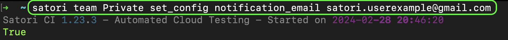

### Slack

To set up Slack notifications in Satori, follow these steps to retrieve your workspace and channel IDs:

Steps to Retrieve Workspace and Channel ID:

1. Open the web version of Slack and navigate to the channel you're interested in.
2. In your browser’s URL bar, you’ll see a URL like this: https://app.slack.com/client/T00000000/C00000000. The part after '/client/' is split into two segments.
3. In the Satori CI dashboard, go to Team > Settings.
4. Enter the first segment of the URL (e.g., T00000000) in the workspace ID field.
5. Insert the Channel ID (e.g., C00000000) in the default channel field to receive notifications.
6. Select Add Satori to Workspace and follow the instructions on the Slack website to add the bot.
7. In Slack, invite the bot to the channel by typing `/invite @SatoriCIBot.`

Or via the CLI command: 

```sh
satori-v2 team Private set_config slack_workspace TXXXXXXXXXX
```

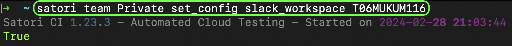

```sh
satori-v2 team Private set_config slack_channel CXXXXXXXXXX
```
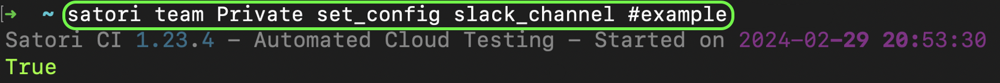

### Discord

To set up Discord notifications in Satori, you first need to obtain the Channel ID. Follow these steps:

**Enabling Developer Mode:**
1. Open your Discord settings by clicking the gear icon in the bottom left corner, next to your username and avatar.
2. In the settings menu, select Appearance under the App Settings category.
3. Scroll down to the Advanced section and toggle on Developer Mode.

**Obtaining the Channel ID:**
1. Right-click the desired channel name in Discord.
2. Select Copy ID from the dropdown menu. The Channel ID is now copied to your clipboard.
*Note: This method can be used to obtain IDs for text channels, voice channels, categories, and individual messages.*

Once you have the Channel ID, you can configure it in Satori Web or with the following command:

```sh
satori-v2 team Private set_config discord_channel CHANNEL_ID
```
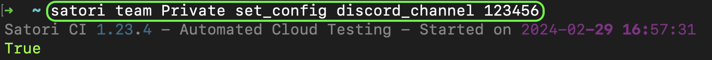

### Telegram

To set up Telegram notifications with Satori, follow these steps:

1. Create a Telegram Channel: ensure you have a Telegram channel and invite the `@satori_ci_bot` to your team.
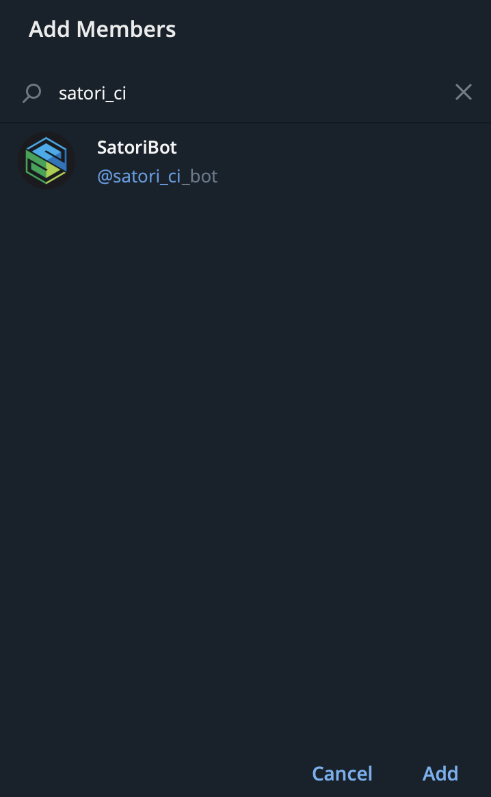

2. Obtain the Channel ID: access your channel via the web at Telegram Web. The Channel ID is the number that appears after the # in the URL (e.g., -15050500050).
Once you have the Channel ID, you can configure it in Satori-CI to start receiving notifications.
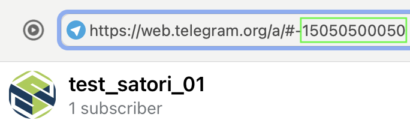

```sh
satori-v2 team Private set_config telegram_channel CHANNEL_ID
```

### Datadog

Satori-CI integrates with Datadog Events for notification management. To set this up, you'll need to create an **API Key** and specify the **Site Region** from Datadog.

#### Step 1: Create an API Key
1. Navigate to **Organization Settings** in your Datadog account.
2. Go to **API Keys**.
3. Click on **+ New Key** to create a new API key for Satori.

#### Step 2: Configure the API Key in Satori-CI
Use the Satori CLI to configure your newly created API key with the following command:

```shell
satori-v2 team Private set_config datadog_api_key {MyDatadogApiKey}
```

- Replace `{MyDatadogApiKey}` with your Datadog API key.

#### Step 3: (Optional) Configure Site Region
By default, events are sent to the **us1** site region. To configure a different site region, use the following command:

```shell
satori-v2 team Private set_config datadog_site {MyDatadogRegion}
```
- Replace `{MyDatadogRegion}` with one of the following options: `us1`, `us3`, `us5`, `eu`, `ap1`, or `us1-fed`.

Via CLI with the following command: 
```sh
satori-v2 team Private set_config datadog_api_key a123
```
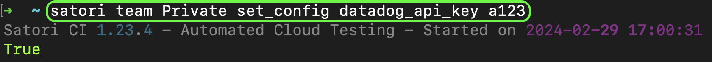

```sh
satori-v2 team Private set_config datadog_site us3|eu|etc
```
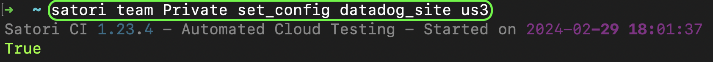

## Report notifications

To receive a copy of your test report in PDF format along with your notifications, you can specify this in your **Playbook Settings**.

```yml
settings:
  notify:
    - result: fail
      to: slack://T00000000:C00000000
  report: pdf
```

If you wish to prevent the generation of any reports, you can set the report option to false. This will ensure that all generated outputs are deleted:

```yml
settings:
  notify:
    - result: fail
      to: slack://T00000000:C00000000
  report: false
```
