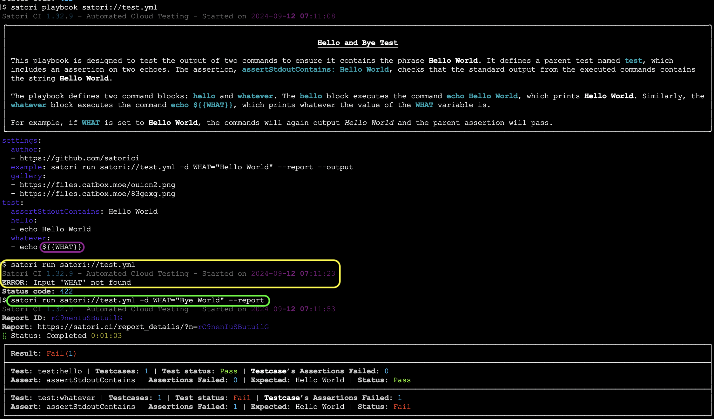

# Inputs

When testing a system the behaviors are analyzed depending on the inputs used to understand what outputs are produced from a [black box perspective](https://en.wikipedia.org/wiki/Black_box). 
 
Software may use inputs that can be either defined within the playbook or to be left undefined within the playbook so it is defined at the moment of execution. Inputs may be valid or invalid to test the behavior of a piece of software from a black-box perspective.

## Parametrized

Consider the following playbook `satori://test.yml` that has a variable defined as `${{WHAT}}` that is not defined within the playbook:

```yml
test:
  assertStdoutContains: Hello World
  hello:
    - echo Hello World
  whatever:
    - echo ${{WHAT}}
```

Whenever referencing that playbook, you will pass the value of `${{WHAT}}`



## Defined within the playbook

Inputs may be defined within the playbook under any name for the software to be executed. On the following example, the `echo` test will iterate throughout the different values defined for `input`:

```yml
input:
- - "One"
  - "Two"

echo:
- echo ${{input}}
```

This is how the output will look like:


You can also define different nested values. The following example will show a Pass for the positive test, and a Fail for the negative test:

```yml
input:
  positive:
  - - "Hello"
  negative:
  - - "Bye"

echo:
  assertStdoutEqual: "Hello World"
  input:
  - echo -n $(input) World
```

For example:


## Dictionaries

Dictionary files can be split by certain characters (normally newlines) to be used as inputs for the tests. For example:

```yml
dict-input:
- - file: dict.txt
    split: \n

echo:
  assertReturnCode: 0
  run:
  - echo ${{dict-input}}
```

## Mutations

Inputs can be mutated to test how software behaves with unexpected values. Mutations can be based on the original string, but they always different. They are specified as follow:

```yml
input:
- - value: "Hello World"
    mutate: radamsa
    mutate_qty: 5

  - value: "Hello World"
    mutate: zzuf
    mutate_qty: 5

echo:
  assertStdoutNotEqual: "Hello World"
  input:
  - echo -n ${{input}}
```

For example:


The previous playbook will generate 10 different mutations of the string "Hello World" using different fuzzers that will be echoed to the standard output and validated that they are not equal to "Hello World".

If you need any help, please reach out to us on [Discord](https://discord.gg/NJHQ4MwYtt) or via [Email](mailto:support@satori-ci.com)
