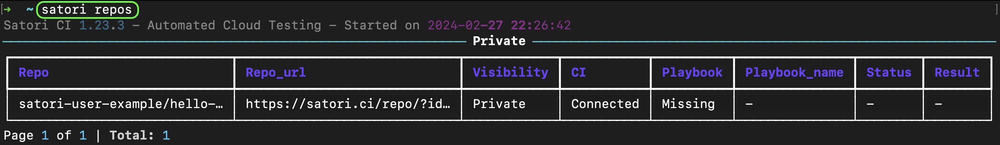
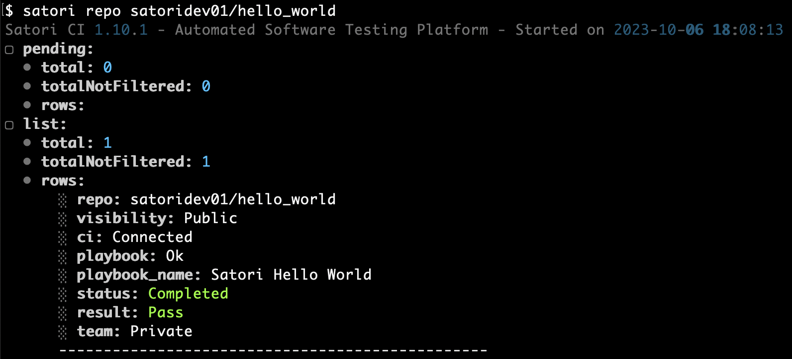
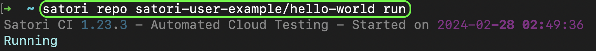
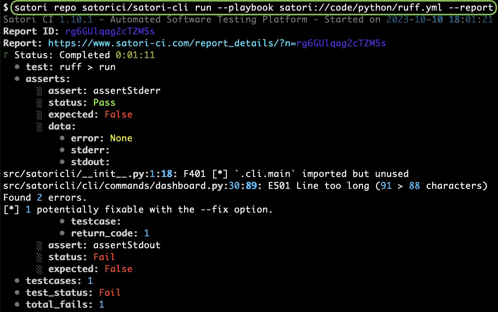
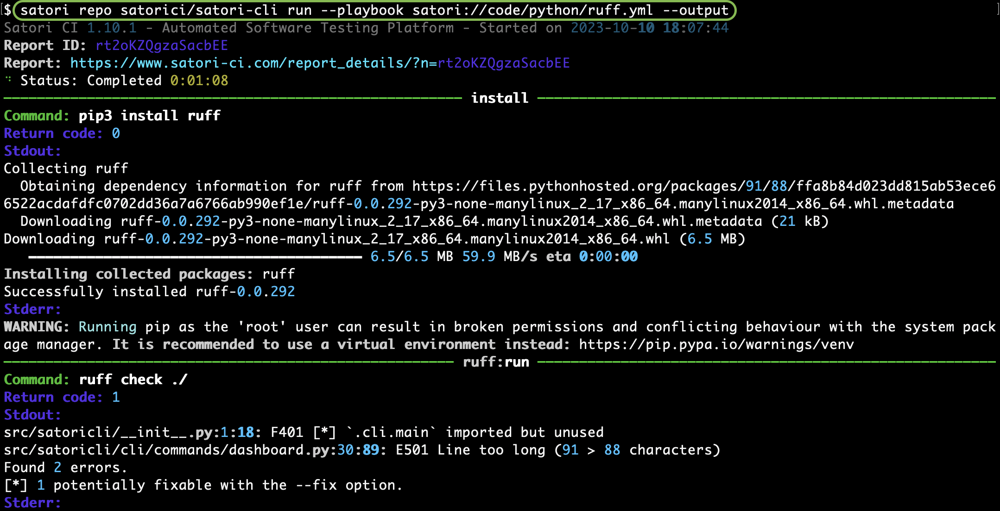
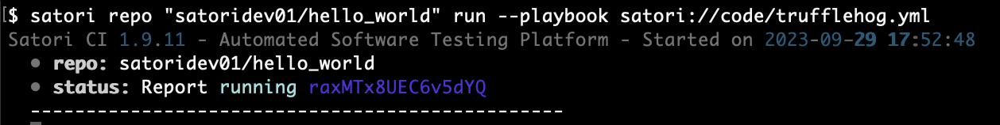
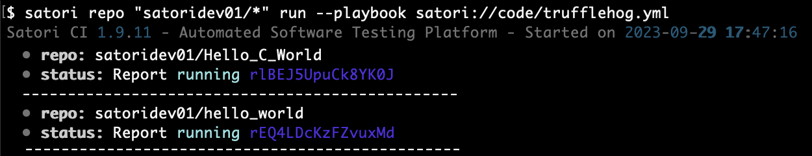
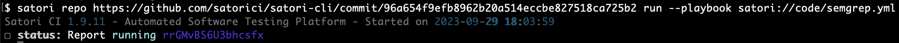

# Repositories

Satori provides automatic testing for repositories, especially when they are connected to our [GitHub Application](https://github.com/apps/satorici). Additionally, it is possible to test repositories not connected to your CI that you have access to.

Whenever you wish to check the status of your repositories, the Satori CLI `repo` command can assist you. It executes the `.satori.yml` playbook within your repository unless you are using public playbooks, which you can list with `satori-cli playbook --public`.

## List

List all your repositories:

```sh
satori repos
```



## Show

This command shows if the repository is connected to CI, whether it has a valid playbook, and the last results of its execution, including any potential errors encountered during the playbook's execution.

```sh
satori repo githubUsername/repository
```



## Run

### Playbook on a Repository

Run the `.satori.yml` playbook on the latest commit of the repository:

```sh
satori repo githubUsername/repository run
```



#### Private Playbook

To run a different playbook instead of `.satori.yml`, specify it with the `--playbook` parameter:

```sh
satori repo githubUsername/repository run --playbook playbook.yml
```

|  |
|:---------------------------------------------------------------:|
| *Report from running the python lint analyzer ruff on the repo satorici/satori-cli* |

|  |
|:--------------------------------------------------------------:|
| *Output from running the python lint analyzer ruff on the repo satorici/satori-cli* |

#### Public Playbook

Public playbooks can be listed with the command:

```sh
satori playbooks --public
```

Public predefined tests by Satori are hosted on https://github.com/satorici/playbooks/, which is abbreviated as `satori://`.

For example, run the public playbook `satori://some/playbook.yml` (equivalent to <https://github.com/satorici/playbooks/some/playbook.yml>):

```sh
satori repo githubUsername/repository run --playbook satori://some/playbook.yml
```



### Run on Multiple Repositories

Trufflehog is a software that finds secrets stored in code. You can run the Trufflehog playbook on all the repositories of a given account. For example:

```sh
satori repo "githubUsername/*" run --playbook satori://code/trufflehog.yml
```



### Analyze Commit

Run the repository's playbook on a specific commit (on any branch you choose):

```sh
satori repo https://github.com/satorici/satori-cli/commit/96a654f9efb8962b20a514eccbe827518ca725b2 run
```


