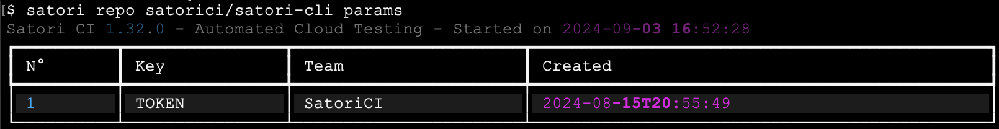

# Repositories

Satori provides automated testing for repositories, particularly those linked to our [GitHub Application](https://github.com/apps/satorici). You can also test repositories that aren't integrated with your CI pipeline but to which you have access.

To check the status of your repositories, use the Satori CLI `repo` command. This command runs the `.satori.yml` playbook in your repository. If you're using public playbooks, you can view available options with the command `satori playbooks --public`.

## List

To list all the repositories connected to Satori-CI, you can use the following command:

```sh
satori repos
```


## Show

This command allows you to check details about your repository's testing status. It displays whether the repository is connected to CI, verifies if a valid playbook is present, and provides the results of the latest playbook execution, including any errors encountered.

```sh
satori repo githubUsername/repository
```


## Run

### Running a Playbook on a Repository

To run the `.satori.yml` playbook on the latest commit of your repository, use:

```sh
satori repo githubUsername/repository run
```


### Private Playbook

If you'd like to run a different playbook instead of `.satori.yml`, specify it using the --playbook parameter:

```sh
satori repo githubUsername/repository run --playbook playbook.yml
```

|  |
|:---------------------------------------------------------------:|
| *Report from running the python lint analyzer ruff on the repo satorici/satori-cli* |

### Public Playbook

Public playbooks provided by Satori can be listed with the command:

```sh
satori playbooks --public
```
These are hosted on GitHub at [[GitHub Application](https://github.com/satorici/playbooks/)](https://github.com/apps/satorici). You can run any public playbook using the `satori://` shortcut.

For example, run the public playbook `satori://code/phyton/ruff.yml` .

```sh
satori repo githubUsername/repository run --playbook satori://code/phyton/ruff.yml --report --output
```


### Run on Multiple Repositories

Trufflehog is a tool that helps to detect sensitive information, such as API keys or secrets, stored within your codebase. You can automate the process of scanning all repositories within a specific account by running the Trufflehog playbook.

To run the Trufflehog playbook on all repositories under a specific GitHub account, use the following command:

```sh
satori repo "githubUsername/*" run --playbook satori://code/trufflehog.yml
```

This command will scan every repository under the provided `githubUsername` using the `trufflehog.yml` playbook, helping you ensure your repositories remain secure.


### Analyze Commit

You can run a playbook on a specific commit within any branch of your repository. This allows you to analyze how a particular commit affects your codebase by running the configured playbook on that specific commit.

To run a repository's playbook on a particular commit, use the following command:

```sh
satori repo https://github.com/satorici/satori-cli/commit/96a654f9efb8962b20a514eccbe827518ca725b2 run
```


---

## Managing parameters for a repository

When your playbook requires sensitive data (e.g., API keys, tokens) that should not be hardcoded directly into the playbook, you can securely define and manage these values through the `params` subcommand.

## Adding a Parameter

To add a new parameter, use the `params add` command with the format:

```
satori repo <repository> params add '<PARAM_NAME>=<VALUE>'
```

**Example:**

```
satori repo satorici/satori-cli params add 'TOKEN=Test123'
```


This will add a new parameter called `TOKEN` with the value `Test123`.

## Listing Parameters

To list all parameters associated with a repository, use the `params` command:

```
satori repo <repository> params
```

**Example:**

```
satori repo satorici/satori-cli params
```



This command displays all stored parameters along with their creation details.

## Deleting a Parameter

If you need to delete an existing parameter, use the `params del` command:

```
satori repo <repository> params del <PARAM_NAME>
```

**Example:**

```
satori repo satorici/satori-cli params del TOKEN
```


This removes the parameter `TOKEN` from the list.

