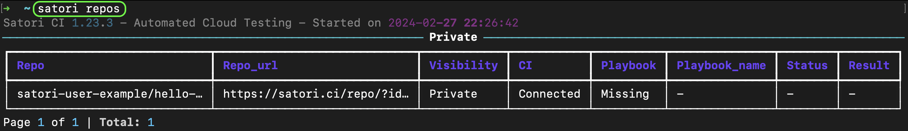
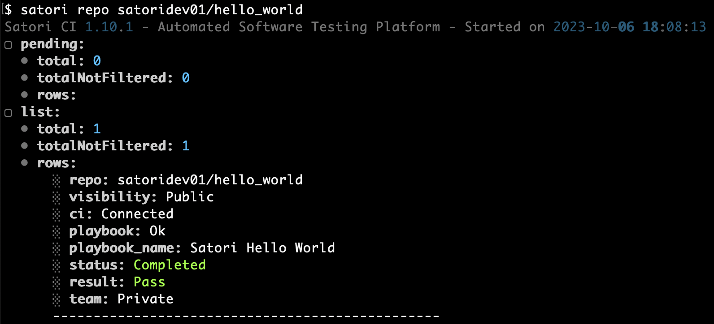
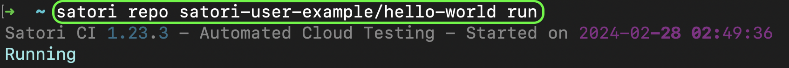
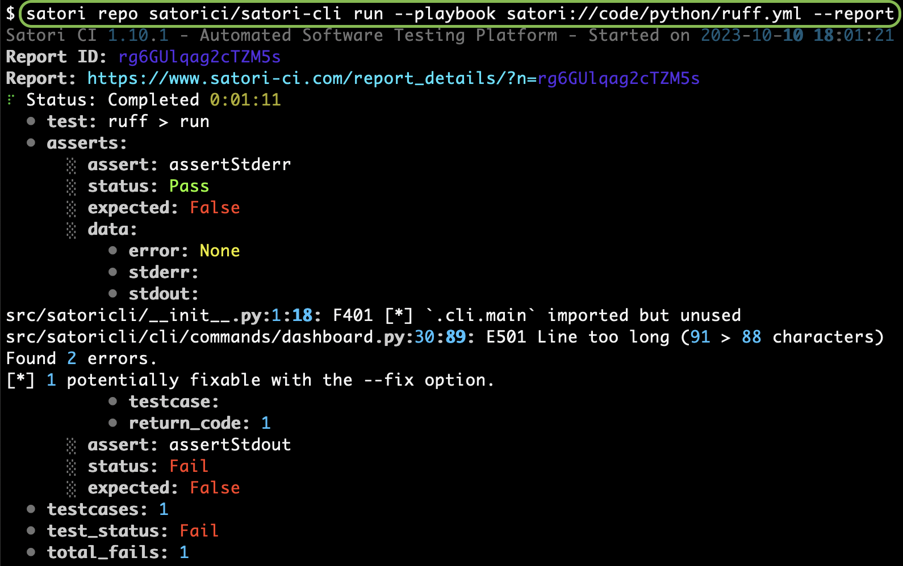
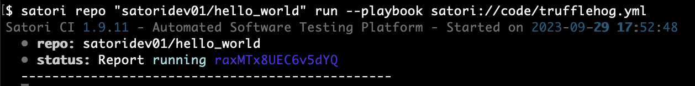
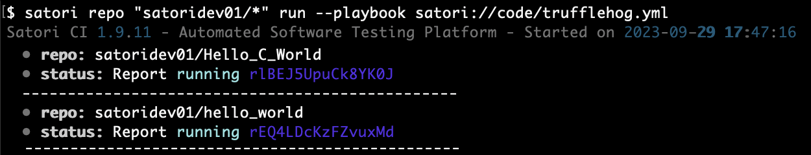
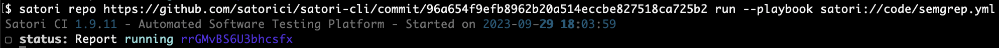
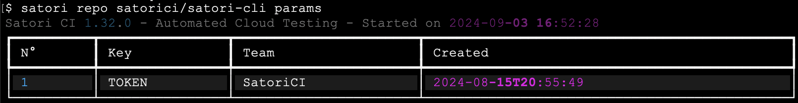

# Repositories

Satori provides automated testing for repositories, particularly those linked to our [GitHub Application](https://github.com/apps/satorici). You can also test repositories that aren't integrated with your CI pipeline but to which you have access.

To check the status of your repositories, use the Satori CLI `repo` command. This command runs the `.satori.yml` playbook in your repository. If you're using public playbooks, you can view available options with the command `satori-v2 playbooks --public` *(`--public` on development; `satori-v2 playbooks` works)*.

## List

To list all the repositories connected to Satori-CI, you can use the following command:

```sh
satori-v2 repos
```



The list is paginated and can be sorted and printed as JSON:

| Flag | Description | Example |
| --- | --- | --- |
| `--order {ASC\|DESC}` | Sort order | `satori-v2 repos --order DESC` |
| `--json` | Print the list as JSON | `satori-v2 repos --json` |
| `--page N` | Page number | `satori-v2 repos --page 2` |
| `-q, --quantity N` | Results per page (default 10, alias `-l/--limit`) | `satori-v2 repos -q 50` |

## CLI v2 equivalents

The `satori-v2 repo` command group described below is not available yet in CLI v2. The same use cases are covered by `run --repo` and `scan`:

| v1 command | CLI v2 equivalent |
| --- | --- |
| `satori-v2 repo owner/repo run` | `satori-v2 run ./.satori.yml --repo owner/repo` (or any playbook source) |
| `satori-v2 repo owner/repo run --playbook satori://code/trufflehog.yml --report --output` | `satori-v2 run satori://code/trufflehog.yml --repo owner/repo --report --output` |
| `satori-v2 repo "owner/*" run --playbook SRC` | `satori-v2 scan "owner/*" SRC` |
| `satori-v2 repo owner/repo commits` | `satori-v2 scan owner/repo SRC` or `satori-v2 scan owner/repo --playbook SRC` |

Running a playbook against a repository with `--repo` creates a one-commit scan job on the latest commit of that repository:

```sh
satori-v2 run satori://code/trufflehog.yml --repo satorici/satori-cli --report --output
```

To run a playbook on the commits of a repository (or on every repository of an account) use `scan`:

```sh
satori-v2 scan satorici/satori-cli satori://code/trufflehog.yml
satori-v2 scan "satorici/*" --playbook satori://code/trufflehog.yml
```

See [Run](modes/run.md) and [Scan](modes/scan.md) for all the available options.

::: warning On development
`satori-v2 repo X` and its subcommands `run`, `commits`, `tests`, `playbook`, `params`, `visibility` and the `--pending` flag are not available yet in CLI v2. The v1 syntax is kept below for reference; see the equivalents above.
:::

## Show

This command allows you to check details about your repository's testing status. It displays whether the repository is connected to CI, verifies if a valid playbook is present, and provides the results of the latest playbook execution, including any errors encountered.

```sh
satori-v2 repo githubUsername/repository
```



## Run

### Running a Playbook on a Repository

To run the `.satori.yml` playbook on the latest commit of your repository, use:

```sh
satori-v2 repo githubUsername/repository run
```



### Private Playbook

If you'd like to run a different playbook instead of `.satori.yml`, specify it using the --playbook parameter:

```sh
satori-v2 repo githubUsername/repository run --playbook playbook.yml
```

|  |
|:---------------------------------------------------------------:|
| *Report from running the python lint analyzer ruff on the repo satorici/satori-cli* |

### Public Playbook

Public playbooks provided by Satori can be listed with the command:

```sh
satori-v2 playbooks --public
```
These are hosted on GitHub at [[GitHub Application](https://github.com/satorici/playbooks/)](https://github.com/apps/satorici). You can run any public playbook using the `satori://` shortcut.

For example, run the public playbook `satori://code/phyton/ruff.yml` .

```sh
satori-v2 repo githubUsername/repository run --playbook satori://code/phyton/ruff.yml --report --output
```



### Run on Multiple Repositories

Trufflehog is a tool that helps to detect sensitive information, such as API keys or secrets, stored within your codebase. You can automate the process of scanning all repositories within a specific account by running the Trufflehog playbook.

To run the Trufflehog playbook on all repositories under a specific GitHub account, use the following command:

```sh
satori-v2 repo "githubUsername/*" run --playbook satori://code/trufflehog.yml
```

This command will scan every repository under the provided `githubUsername` using the `trufflehog.yml` playbook, helping you ensure your repositories remain secure.



### Analyze Commit

You can run a playbook on a specific commit within any branch of your repository. This allows you to analyze how a particular commit affects your codebase by running the configured playbook on that specific commit.

To run a repository's playbook on a particular commit, use the following command:

```sh
satori-v2 repo https://github.com/satorici/satori-cli/commit/96a654f9efb8962b20a514eccbe827518ca725b2 run
```



---

## Managing parameters for a repository

When your playbook requires sensitive data (e.g., API keys, tokens) that should not be hardcoded directly into the playbook, you can securely define and manage these values through the `params` subcommand.

## Adding a Parameter

To add a new parameter, use the `params add` command with the format:

```
satori-v2 repo <repository> params add '<PARAM_NAME>=<VALUE>'
```

**Example:**

```
satori-v2 repo satorici/satori-cli params add 'TOKEN=Test123'
```


This will add a new parameter called `TOKEN` with the value `Test123`.

## Listing Parameters

To list all parameters associated with a repository, use the `params` command:

```
satori-v2 repo <repository> params
```

**Example:**

```
satori-v2 repo satorici/satori-cli params
```



This command displays all stored parameters along with their creation details.

## Deleting a Parameter

If you need to delete an existing parameter, use the `params del` command:

```
satori-v2 repo <repository> params del <PARAM_NAME>
```

**Example:**

```
satori-v2 repo satorici/satori-cli params del TOKEN
```


This removes the parameter `TOKEN` from the list.

---

## Advanced Repository Command Options

The `satori-v2 repo` command provides extensive options for running playbooks and managing test results.

### Running with Options

| Flag | Description | Example |
| --- | --- | --- |
| `-b, --branch BRANCH` | Run on specific branch (default: main) | `satori-v2 repo user/repo run -b develop` |
| `-d, --data JSON` | Provide secrets/parameters as JSON | `satori-v2 repo user/repo run -d '{"KEY":"value"}'` |
| `--playbook URI` | Override repository's default playbook | `satori-v2 repo user/repo run --playbook satori://code/semgrep.yml` |
| `-s, --sync` | Wait for run to complete | `satori-v2 repo user/repo run --sync` |
| `-o, --output` | Display command output | `satori-v2 repo user/repo run --sync --output` |
| `-r, --report` | Display test results | `satori-v2 repo user/repo run --sync --report` |
| `--visibility {public\|private\|unlisted}` | Set run visibility | `satori-v2 repo user/repo run --visibility public` |

### Test Results Management

| Flag | Description | Example |
| --- | --- | --- |
| `-a, --all` | Show all test results | `satori-v2 repo user/repo tests --all` |
| `-l, --limit NUMBER` | Limit number of results (default: 100) | `satori-v2 repo user/repo tests -l 50` |
| `--fail` | Show only failed tests | `satori-v2 repo user/repo tests --fail` |

### Repository Information

| Flag | Description | Example |
| --- | --- | --- |
| `--pending` | Show pending actions in repository info | `satori-v2 repo user/repo --pending` |

### Playbook Management

| Command | Description | Example |
| --- | --- | --- |
| `playbook list` | List playbooks associated with repository | `satori-v2 repo user/repo playbook list` |
| `playbook add URI` | Add playbook to repository | `satori-v2 repo user/repo playbook add satori://code/semgrep.yml` |
| `playbook del URI` | Remove playbook from repository | `satori-v2 repo user/repo playbook del satori://code/semgrep.yml` |
| `playbook clean --delete-commits` | Delete playbook data and commit records | `satori-v2 repo user/repo playbook clean --delete-commits` |

### Complete Example

Run a playbook on a specific branch with parameters and view the output:

```sh
satori-v2 repo satorici/satori-cli run \
  -b develop \
  -d '{"API_KEY":"secret","TIMEOUT":"300"}' \
  --playbook satori://code/trufflehog.yml \
  --sync \
  --report \
  --output \
  --visibility private
```

This command:
- Runs on the `develop` branch
- Provides two secret parameters
- Uses the Trufflehog playbook
- Waits for completion
- Displays both report and output
- Sets visibility to private

### Filter Failed Tests

To quickly identify issues, filter for failed tests only:

```sh
satori-v2 repo user/repo tests --fail -l 20
```

This shows the 20 most recent failed tests for the repository.

