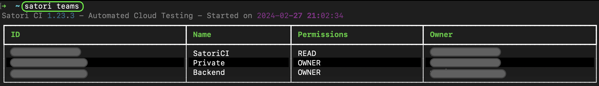
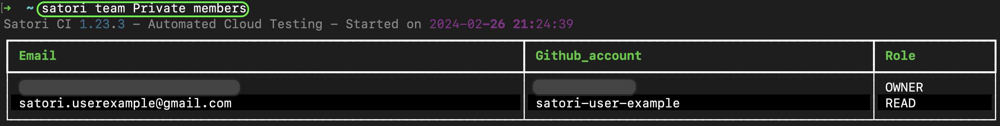
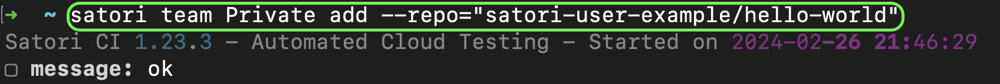

# Teams

By default, you are a member of your own **Private** team. Here is where your repositories and monitors will be by default. Teams allow you to group monitors, repositories, and people with their own notifications channels.



#### List Members

You can list the members of your teams like this:

```sh
satori team Private members
```



#### Add Member

If the user's email is part of Satori CI, it will be automatically added. Otherwise, they will receive an invitation to join your team.

```sh
satori team Private add --email="member_email@yourdomain.com"
```


## Create a Team

This is how you would create the "Backend" team:

```sh
satori team Backend create
```

#### Add or delete repositories of your Team

Include within your Backend team a certain repo:

```sh
satori team Backend add --repo="GithubAccount/Repository"
```


You can also include all the repositories of a certain account with:

```sh
satori team Private add --repo="GithubAccount/repo-name"
```



If you want to remove them, you can use the `delete` subcommand.

#### List your team repositories

You can list the repositories of your team like this:

```sh
satori team Private repos
```

#### Add or delete monitors of your team

Once you launched a monitor, you can associate it with a team:

```sh
satori team Private add monitor="ID"
```

If you want to remove them, you can use the `delete` subcommand.

#### List Monitors

You can list the monitors of your team like this:

```sh
satori team Private monitors
```

## Delete a Team

You can remove a team like this:

```sh
satori team TeamName delete
```

## Team Notifications

You can get the following notification configurations:

- slack_workspace
- slack_channel
- discord_channel
- notification_email

And it would be used like this:

```sh
$ satori team SatoriCI get_config discord_channel
Satori CI 1.2.51 - Automated Software Testing Platform - Started on 2023-07-03 16:50:40
discord_channel: 87654
```

The previous value, was defined like this:

```sh
$ satori team Private set_config discord_channel 87654
True
```
