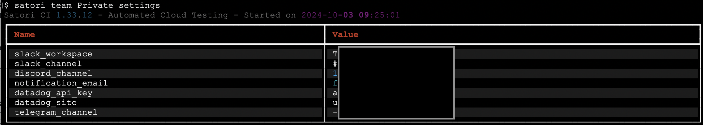

# Teams

By default, you are part of your own **Private** team. This is the space where your repositories and monitors are created and managed unless specified otherwise. Teams help you organize monitors, repositories, and collaborators, and they also provide custom notification channels for efficient communication.

```sh
satori teams
```


## Create a Team

To create a new team, use the following command:

```sh
satori team Backend create
```

This example creates a team named Backend. You can replace "Backend" with any other team name to suit your project needs.

## Add Member

If the specified email is already associated with a Satori CI account, the user will be automatically added to your team. If not, they will receive an email invitation to join. 
To add a new member to your team, use the following command:

```sh
satori team Private add --email="member_email@yourdomain.com"
```


## Listing team members

To view the members of your teams, use the following command:

```sh
satori team Private members
```


## Managing repositories in your team

To add a specific repository to your team, use the following command:

```sh
satori team Backend add --repo="GithubAccount/Repository"
```


You can also add all repositories from a specific GitHub account to your team with:

```sh
satori team Backend add --github="GithubAccount"
```


If you need to remove a repository from the team, use the following command with the delete subcommand:

```sh
satori team Backend del --repo="GithubAccount/Repository"
```

## Listing your team repositories

To view all the repositories associated with your team, use the following command:

```sh
satori team Private repos
```

## Adding or deleting monitors from your team

Once a monitor is created, you can associate it with your team using this command:

```sh
satori team TEAM add --monitor="MONITORID"
```

To remove a monitor from the team, use the delete subcommand:

```sh
satori team TEAM del --monitor="MONITORID"
```

## Listing team monitors

To list all the monitors associated with your team, use the following command:

```sh
satori team Private monitors
```

## Delete a Team

To remove an existing team, use the following command:

```sh
satori team TeamName delete
```

## Team Notifications

You can visualize the notification settings of a team. This is how you would do it for your Private team:

```sh
satori team Private settings
```



These are the possible communication channels:

- slack_workspace
- slack_channel
- discord_channel
- notification_email
- telegram_channel

You can view with `get_config` the specific setting for your team or set it with `set_config` command.

#### Viewing notification configuration

To check the current notification configuration for a specific channel, use the following command:

```sh
$ satori team Private get_config discord_channel
Satori CI 1.2.51 - Automated Software Testing Platform - Started on 2023-07-03 16:50:40
discord_channel: 87654
```

#### Setting notification configuration

To update or set the configuration for a notification channel:

```sh
$ satori team Private set_config discord_channel 87654
True
```
