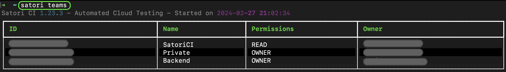
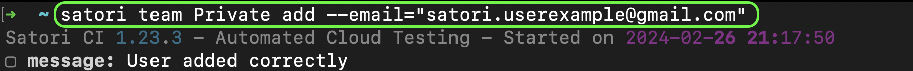
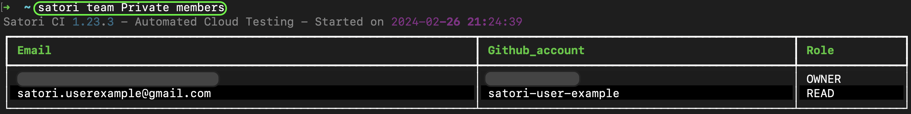
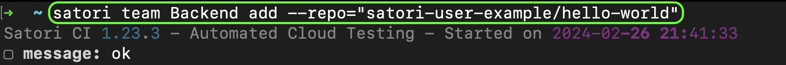
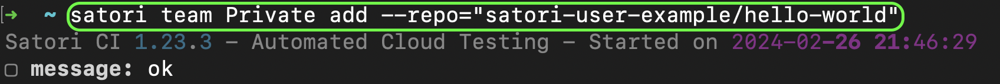

# Teams

::: warning On development
`satori-v2 teams` and `satori-v2 team ...` are not available yet in CLI v2. The v1 syntax is kept here for reference. Teams can still be managed from the web [dashboard](https://www.satori.ci/dashboard/).
:::

By default, you are part of your own **Private** team. This is the space where your repositories and monitors are created and managed unless specified otherwise. Teams help you organize monitors, repositories, and collaborators, and they also provide custom notification channels for efficient communication.

```sh
satori-v2 teams
```



## Create a Team

To create a new team, use the following command:

```sh
satori-v2 team Backend create
```

This example creates a team named Backend. You can replace "Backend" with any other team name to suit your project needs.

## Add Member

If the specified email is already associated with a Satori CI account, the user will be automatically added to your team. If not, they will receive an email invitation to join. 
To add a new member to your team, use the following command:

```sh
satori-v2 team Private add --email="member_email@yourdomain.com"
```



## Listing team members

To view the members of your teams, use the following command:

```sh
satori-v2 team Private members
```



## Managing team repositories

To add a specific repository to your team, use the following command:

```sh
satori-v2 team Backend add --repo="GithubAccount/Repository"
```



You can also add all repositories from a specific GitHub account to your team with:

```sh
satori-v2 team Backend add --github="GithubAccount"
```



If you need to remove a repository from the team, use the following command with the delete subcommand:

```sh
satori-v2 team Backend del --repo="GithubAccount/Repository"
```

## Listing your team repositories

To view all the repositories associated with your team, use the following command:

```sh
satori-v2 team Private repos
```

## Adding or deleting team monitors 

Once a monitor is created, you can associate it with your team using this command:

```sh
satori-v2 team TEAM add --monitor="MONITORID"
```

To remove a monitor from the team, use the delete subcommand:

```sh
satori-v2 team TEAM del --monitor="MONITORID"
```

## Listing team monitors

To list all the monitors associated with your team, use the following command:

```sh
satori-v2 team Private monitors
```

## Delete a Team

To remove an existing team, use the following command:

```sh
satori-v2 team TeamName delete
```

## Team Notifications

You can configure and view notification settings for your team using the `satori-v2 settings` command or the `satori-v2 team` command alias.

### Interactive Configuration

Open an interactive menu to configure all notification settings for a team:

```sh
satori-v2 team Private settings
```

This is an alias for `satori-v2 settings --team Private` and provides a guided setup for all notification channels (Slack, Discord, Email, Telegram, Datadog).

For complete documentation on the `satori-v2 settings` command including all modes of operation (interactive, view, and direct configuration), see the [Notifications](/notifications.md#interactive-configuration-with-satori-settings) section.

### View Notification Configuration

To check the current notification configuration for a specific channel, use the `get_config` command:

```sh
satori-v2 team Private get_config discord_channel
```

Available configuration keys:
- `slack_workspace`
- `slack_channel`
- `discord_channel`
- `notification_email`
- `telegram_channel`
- `datadog_api_key`
- `datadog_site`

### Set Notification Configuration

To update or set the configuration for a notification channel, use the `set_config` command:

```sh
satori-v2 team Private set_config discord_channel 87654
```

Alternatively, you can use the `satori-v2 settings` command for direct configuration:

```sh
satori-v2 settings discord 87654 --team Private
```
